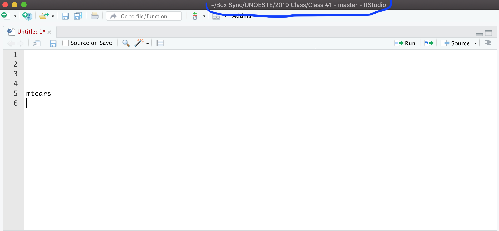
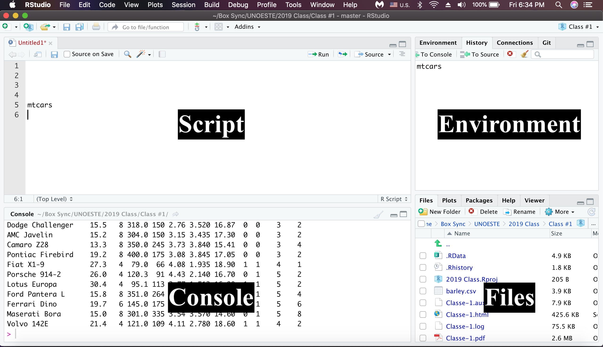
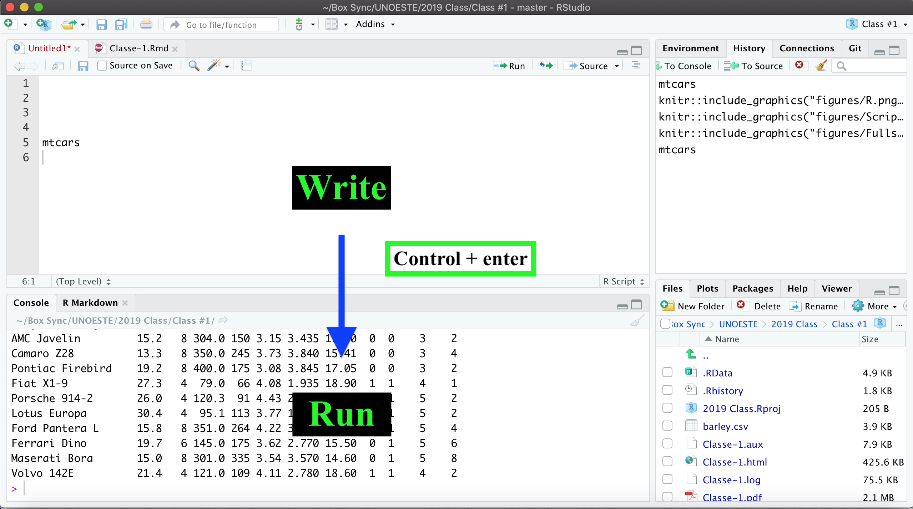
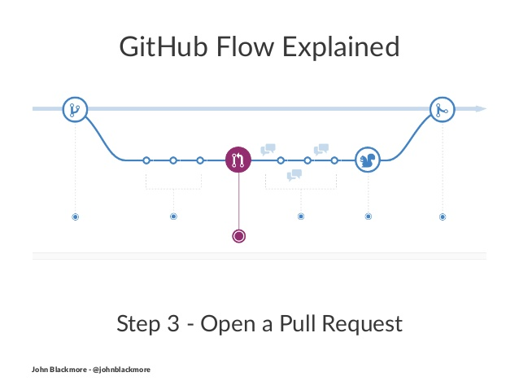

# Outline

- Introdução

- R e o Rstudio?

- Git e GitHub


# Introdução

Os cientistas de dados extraem informações dos dados e as usam para criar previsões, visualizações e tecnologias. Para aprender com os dados, geralmente precisamos executar bilhões de cálculos em grandes conjuntos de dados. Fazemos isso com a ajuda de computadores, que precisam receber um conjunto de instruções. Nós nos referimos a escrever estas instruções como programação.

Há uma variedade de linguagens de computador que podemos usar para programação. Vamos nos concentrar no aprendizado de R, uma linguagem que oferece excelente suporte ao trabalho em ciência de dados. Uma caracteristica distintiva da linguguem de programação em R é ter sido desenvolvida para análise de dados.


# O que é o R e o RStudio?

- **R** – uma linguagem de programação + *software* que a interpreta


- **RStudio** – *software* popular para escrever *scripts* R e interagir com o *software* R


#  Por que aprender o R?


- De graça, *open source*, pode ser usado em várias plataformas
  - 10,000 + pacotes (*packages*)
  - Funciona com vários tipos de dados
  - Reprodutibilidade e repetibilidade
  
- Análise estatística de dados 

- Aprendizado de máquina (*machine learning*, *deep learning*)

- Figuras/gráficos de alta qualidade

- Fazer blogs/websites

- Escrever documentos/manuscritos

- Apresentações 


# Como baixar o R e o RStudio?


- Entre no site **R**: https://www.r-project.org


- Entre no site **Rstudio**: https://rstudio.com


- [Video tutorial em português](https://www.youtube.com/watch?v=8LnZNC4hxdQ)


# Criando um projeto no **Rstudio**

- Abra o programa **RStudio**
- *File* > *New project* > *New directory* 
- **Directory name:** Escolha o nome para o arquivo: exemplo: `Aula-1`
- Escolha um local conveniente no seu computador:
- *Create a project of a subdirectory of* ~/ é o arquivo principal na qual seu projeto será armazeando.
- Clique em “*Create project*”
 
## Criando um arquivo no **R** (R script) 

- File > New File > R script (.R or .Rmd)

- O .R ou .Rmd script ficará armazenado no projeto criado anteriormente `Aula-1`

- Mantenha o .R ou .Rmd atualizado clicando na opção salvar ("disquete") na barra de ferramentas do Rstudio.

```{r, echo=FALSE, fig.cap="", out.width = '100%', fig.align="center", fig.retina = 2, fig.pos='h'}

```


# Interface do Rstudio

A interface do Rstudio é dividida em quatro partes.

```{r, echo=FALSE, fig.cap="", out.width = '100%', fig.align="center", fig.retina = 2, fig.pos='h'}

```

#  Script vs Console

- Os dois aceitam comandos
- *Console*: executa os comandos
- *Script*: comandos que você queira salvar para usar depois;
  - Executa com Run
  - Ctrl+enter para executar os comandos
  - Comandos executados aparecem no *Console*

```{r, echo=FALSE, fig.cap="", out.width = '80%', fig.align="center", fig.retina = 2, fig.pos='h'}

```


# Controle de versão

## Git

**Git** é um sistema de controle de versão (*version control*). Seu objetivo original era ajudar grupos de desenvolvedores a trabalhar em colaboração em grandes projetos de software. O Git gerencia a evolução de um conjunto de arquivos - chamado repositório - de uma maneira altamente estruturada. Se você não tem idéia do que estou falando, pense nisso como os recursos "Rastrear alterações" do Microsoft Word.

## GitHub

É aqui que entram os serviços de hospedagem como [GitHub](https://github.com), [Bitbucket](https://bitbucket.org/) e [GitLab](https://about.gitlab.com). Eles fornecem um lar para seus projetos baseados em Git na Internet. Se você não tem idéia do que estou falando, pense nisso como DropBox, mas muito, muito melhor. O host remoto atua como um canal de distribuição ou câmara de compensação para seu projeto gerenciado pelo Git. Ele permite que outras pessoas vejam suas coisas, sincronizem com você e talvez até façam alterações. Esses provedores de hospedagem aprimoram os servidores Unix Git tradicionais com interfaces baseadas na Web bem projetadas.


```{r, echo=FALSE, fig.cap="", out.width = '80%', fig.align="center", fig.retina = 2, fig.pos='h'}

```


## O que há de especial em usar R com Git e GitHub?


Livro [Happy Git and GitHub for the useR](https://happygitwithr.com)

