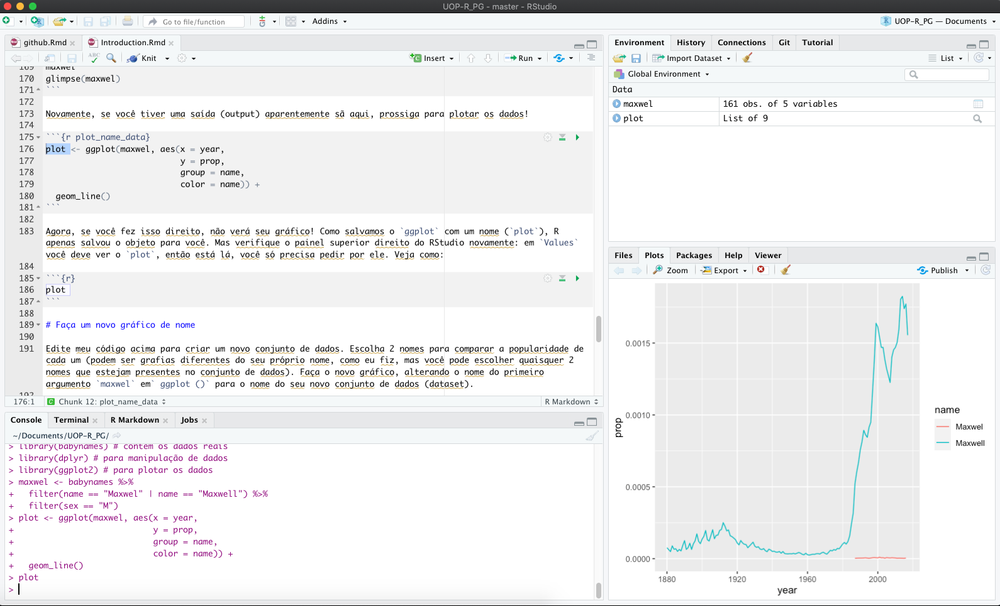

```{r setup, include = FALSE, cache = FALSE}
knitr::opts_chunk$set(error = TRUE, comment = NA, warnings = FALSE, errors = FALSE, messages = FALSE, tidy = FALSE)
```

```{r load-packages, include = FALSE}
library(tidyverse)
library(babynames)
```

> Leia até o passo 6! E observe que há um arquivo que precisa ser entregue na primeira aula!

# Visão geral

Este documento irá guiá-lo através das etapas para instalar e usar [R, um ambiente de software gratuito e de código aberto para computação estatística e gráficos.](Https://www.r-project.org)


- O que é R?

**R** é o nome da própria linguagem de programação, baseada no S da Bell Labs, que os usuários acessam por meio de um interpretador de linha de comando (`>`)


- O que é RStudio?

**RStudio** é uma poderosa interface de usuário e conveniente que permite acessar a linguagem de programação R junto com vários outros recursos que aprimoram a funcionalidade (e a sanidade).

Nosso objetivo final é fazer você olhar para uma tela como esta:



- O que é Github?

O **Github** é um site que fornece hospedagem para desenvolvimento de software e controle de versão usando Git. O Github não é um requisito para usar o R/Rstudio mas otimiza o uso do programa e vamos usar durante nosso curso.

# Instale R

Instale o R a partir de [CRAN, The Comprehensive R Archive Network](https://cran.rstudio.com). Escolha uma **distribuição binária pré-compilada** para seu sistema operacional.

* Se precisar de mais ajuda, confira um dos vídeos a seguir (cortesia de Roger Peng em Johns Hopkins Biostatistics):
    - [Instalando o R em um mac](https://www.youtube.com/watch?v=Icawuhf0Yqo&feature=youtu.be)
    - [Instalando o R no Windows](https://www.youtube.com/watch?v=mfGFv-iB724&feature=youtu.be)

* Se precisar de mais ajuda, leia este [guia passo a passo](https://beckmw.files.wordpress.com/2014/09/r_install_guide.pdf), incluindo capturas de tela.

## Checando

Inicie o R. Você deve ver um console com um interpretador de linha de comando (`>`). Feche o R.

# Instale o RStudio

Instale a edição gratuita de código aberto do RStudio: http://www.rstudio.com/products/rstudio/download/

O RStudio fornece uma interface poderosa de usuário para R, chamada de *ambiente de desenvolvimento integrado (IDE)*. RStudio inclui:

* um console (a interface de linha de comando padrão: `>`),
* um editor de realce de sintaxe que oferece suporte à execução direta de código e
* Ferramentas para plotagem, histórico, depuração e gerenciamento de espaço de trabalho.


## Checando

Inicie o RStudio. Você deve obter uma janela semelhante à captura de tela que vê [aqui](https://www.rstudio.com/wp-content/uploads/2014/04/rstudio-workbench.png), mas a sua estará vazia. Observe o painel inferior esquerdo: esta é a mesma janela do console que você viu quando abriu R na etapa 1.15.

* Posicione o cursor onde você vê `>` e digite `x <- 2 + 2`, pressione Enter ou Return, digite `x` e pressione Enter / Return novamente.
* Se `[1] 4` for impresso na tela, você instalou com sucesso R e RStudio e pode prosseguir com a instalação de pacotes.


# Instale o Github

Instale o Github no site https://github.com. Crie uma conta, use um e-mail profissional. Não baixe nenhum software. Após a conta criada no site, saia e feche o site. Não vai precisar do Github para essa atividade.


# Instalando pacotes

A versão de R que você acabou de baixar é considerada a base R, o que fornece computação estatística e recursos gráficos bons, mas básicos. Para superpoderes analíticos e gráficos, você precisará instalar pacotes (`packages`) complementares, que são escritos pelo usuário, para estender/expandir seus recursos de R. Os pacotes podem residir em um de dois lugares:

* Eles podem ser cuidadosamente selecionados pelo CRAN (que envolve um processo completo de submissão e revisão) e, portanto, são fáceis de instalar usando `install.packages("name_of_package", dependencies = TRUE)`.

* Como alternativa, eles podem estar disponíveis no [GitHub](https://github.com). Para baixar esses pacotes, você primeiro precisa instalar o pacote `devtools`.

```{r devtools, eval = FALSE}
install.packages("devtools")
library(devtools)
install_github("nome_do_pacote")
```

Posicione seu cursor no console novamente (onde você digitou pela última vez `x` e` [4]` impresso na tela). Você pode usar o primeiro método mencionado acima para instalar os seguintes pacotes diretamente do CRAN, todos os quais usaremos:

  * [`dplyr`,](http://dplyr.tidyverse.org)
  * [`ggplot2`,](http://ggplot2.tidyverse.org)
  * [`babynames`](https://github.com/hadley/babynames)

  
Você também pode baixar tudo de uma vez:
```{r c_install, eval = FALSE}
install.packages(c("dplyr", "ggplot2", "babynames"), 
                 dependencies = TRUE)
```

<p class = "text-info"> __Cuidado: __ Devemos apresentar formalmente o comando de combinação, [`c()`](http://stat.ethz.ch/R-manual/R-patched/library/base/html/c.html), usado acima. Você vai usar isso com frequência, sempre que quiser combinar coisas em um vetor. </p>

```{r c_demo}
c("oi", "meu", "nome", "e", "maxwel")
c(1:3, 20, 50)
```

Cuidado com o uso de citações com cuidado com os pacotes.

* Para *instalar* um pacote (`package`), você coloca o nome do pacote entre aspas como em `install.packages("nome_do_pacote")`.
* Para *usar* um pacote já instalado, você deve carregá-lo primeiro, como em `library(nome_do_pacote)`. Você só precisa fazer isso uma vez por sessão RStudio.
* Se você quiser *ajuda*, não são necessárias aspas: `help(nome_do_pacote)` ou `?nome_do_pacote`.
* Se você quiser a *citação* de um pacote (e você deve dar crédito onde o crédito é devido), pergunte a R como em `citação("nome_do_pacote")`.

```{r show_dplyr, eval = F}
install.packages("dplyr", dependencies = TRUE)
library(dplyr)
help("dplyr")
```

```{r help_dplyr}
citation("ggplot2")
```


<p class = "text-info"> __Cuidado: __ O R **diferencia maiúsculas de minúsculas**, então `?dplyr` funciona, mas`?Dplyr` não. Da mesma forma, uma variável chamada `A` é diferente de` a`. Assim como devemos evitar acentos (ex., à, õ, é) </p>

# Faça um gráfico de nome

Abra um novo script R no RStudio indo em `File -> New File -> R Script`. Para esta primeira incursão em R, vou lhe dar o código, então sente-se e relaxe e fique à vontade para copiar e colar meu código com alguns pequenos ajustes.

Primeiro carregue os pacotes:

```{r show_name_packages, eval = F}
library(babynames) # contém os dados reais
library(dplyr) # para manipulação de dados
library(ggplot2) # para plotar os dados
```


A seguir, seguiremos [práticas recomendadas para inspecionar um conjunto de dados recém-lido](https://cran.r-project.org/doc/contrib/de_Jonge+van_der_Loo-Introduction_to_data_cleaning_with_R.pdf). Além disso, consulte ["O que eu faço quando obtenho um novo conjunto de dados conforme informado por meio de tweets"](http://simplystatistics.org/2014/06/13/what-i-do-when-i-get-a- new-data-set-as-told-through-tweets /) para mais ideias sobre como explorar um novo conjunto de dados. Aqui estão alguns comandos críticos para obter uma visão geral de alto nível de seu conjunto de dados recém-lido em R. Vamos chamá-lo de dizer olá para seu conjunto de dados:

```{r hlo_dataset}
glimpse(babynames) # dplyr
head(babynames) # base R
tail(babynames) # same
names(babynames) # same
```


Se você fez o que precede e produziu uma saída aparentemente sã, está pronto para a próxima parte. Use o código abaixo para criar um novo quadro de dados chamado `maxwell`.

```{r manipulate_name_data}
maxwel <- babynames %>%
  filter(name == "Maxwel" | name == "Maxwell") %>% 
  filter(sex == "M") 
```

* A primeira parte cria um novo conjunto de dados chamado `maxwel` que é uma cópia do conjunto de dados` babynames` - o `%>%` diz que estamos fazendo outras coisas nele.

* A segunda parte filtra (`filter`) nossos` nomes de bebês` para manter apenas as linhas em que o `nome` é Maxwel ou Maxwell (leia` | `como _" ou "_.)

* A terceira parte filtra  aplica outro filtro (`filter`) para manter apenas aqueles onde o sexo é masculino.

Vamos verificar os dados.

```{r}
maxwel
glimpse(maxwel)
```

Novamente, se você tiver uma saída (output) aparentemente normal, prossiga para plotar os dados!

```{r plot_name_data}
plot <- ggplot(maxwel, aes(x = year, 
                           y = prop,  
                           group = name, 
                           color = name)) + 
  geom_line()  
```

Agora, se você fez isso direito, não verá seu gráfico! Como salvamos o `ggplot` com um nome (`plot`), R apenas salvou o objeto para você. Mas verifique o painel superior direito do RStudio novamente: em `Values` você deve ver o `plot`, então está lá, você só precisa pedir por ele. Veja como:

```{r}
plot 
```

# Faça um novo gráfico de nome

Edite meu código acima para criar um novo conjunto de dados (`dataset`). Escolha 2 nomes para comparar a popularidade de cada um (podem ser grafias diferentes do seu próprio nome, como eu fiz, mas você pode escolher quaisquer 2 nomes que estejam presentes no conjunto de dados). Faça o novo gráfico, alterando o nome do primeiro argumento `maxwel` em` ggplot()` para o nome do seu novo conjunto de dados (dataset).


## Salvar e compartilhar

Salve seu trabalho para que você possa compartilhar seu gráfico favorito conosco. Você não gostará da aparência do seu gráfico se passar o mouse sobre `Export` e `Save as` (salvá-lo). Em vez disso, use o comando `ggplot2` para salvar um gráfico com padrões razoáveis:

```{r eval = FALSE}
help(ggsave)
```

```{r eval = F}
ggsave("max_oliveira.pdf", plot) # por favor, mude o nome do arquivo!
```

Deixe o gráfico pronto para a aula do dia 21/09. 


# Outros projetos legais de `babynames`


- Julia Silge *'My Baby Boomer Name Might Have Been "Debbie"'*: https://juliasilge.com/blog/my-baby-boomer-name/
    - Use Julia's Shiny app: https://juliasilge.shinyapps.io/PredictNamesApp/


- Hilary Parker: Hilary: The Most Poisoned Baby Name in US History: https://hilaryparker.com/2013/01/30/hilary-the-most-poisoned-baby-name-in-us-history/


