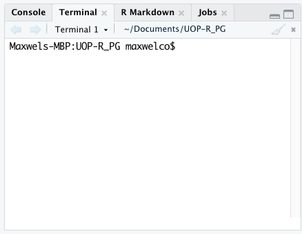
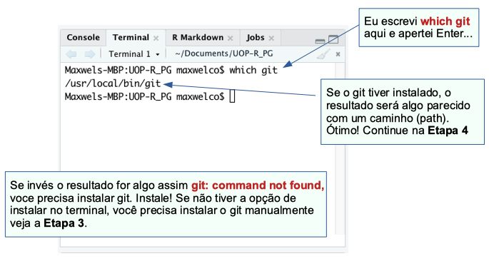
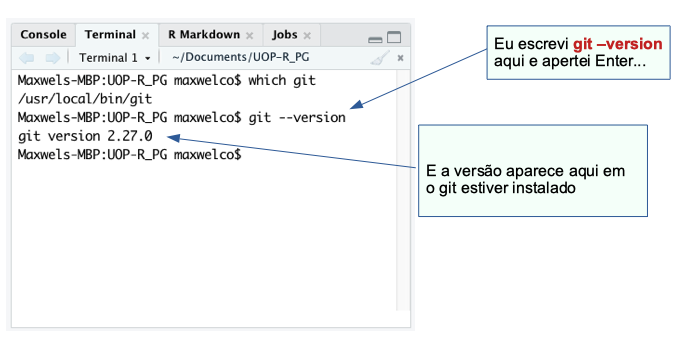
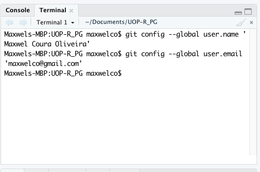
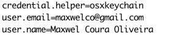
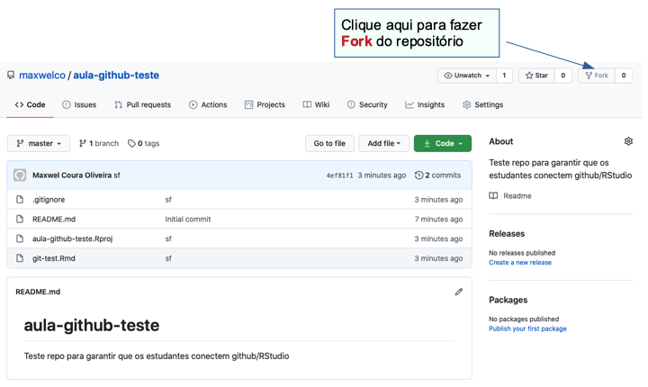
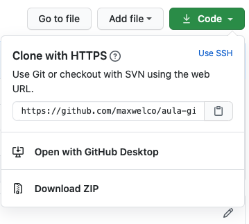
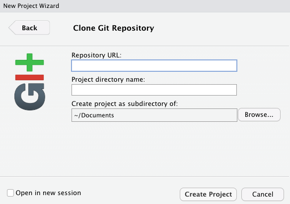
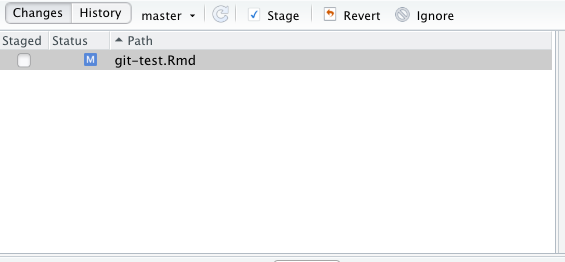

As etapas descritas aqui são amplamente baseadas no Happy Git with R de Jenny Bryan (www.happygitwithr.com). É ótimo, fácil de seguir e muito mais completo (e provavelmente tecnicamente correto) do que este documento.


## PASSO 0. CRIE UMA CONTA GITHUB

- Vá para github.com para registrar uma conta (você deveria ter feito isso na Atribuição 1).
- Escolha seu nome de usuário e e-mail com cuidado! > Para dicas sobre nome de usuário, etc., consulte o Capítulo 4 do livro de Jenny: http://happygitwithr.com/github-acct.html


## ETAPA 1. CONECTAR RSTUDIO com GITHUB
**Nota:** isso pressupõe que você tenha uma versão recente do R/RStudio instalada e em execução com êxito. Caso contrário, consulte as recomendações no livro de Jenny, Capítulo 5: http://happygitwithr.com/install-r-rstudio.html

Abra o RStudio e vá para o Terminal >>

No RStudio, se ainda não houver uma guia ‘Terminal’ ao lado da guia Console, vá para Tools > Terminal > New Terminal para abrir uma. Se Terminal não for uma opção, então Tools > Shell. Isso será parecido com isto (mas com as informações e o nome do seu computador em vez dos meus) e haverá um cursor piscando ativo no final dele.


```{r, echo=FALSE, fig.cap="", out.width = '50%', fig.align="center", fig.retina = 2, fig.pos='h'}

```


## ETAPA 2. VERIFIQUE PARA VER SE VOCÊ JÁ TEM O GIT INSTALADO

Onde o cursor ativo está, digite `which git` (nota: USUÁRIOS DE PC digite `where git`) e pressione Enter. Se o git estiver instalado, ele retornará um caminho para algo como usr / bin / git (pode não corresponder exatamente, mas se surgir um caminho que termine com git, então você o tem, eu acho). Se você tiver o git instalado, continue na Etapa 4 para configurar o GitHub.

Você pode ser solicitado a instalar o git automaticamente se não o tiver - faça isso! Escolha sim! Se você não for solicitado a instalar automaticamente, vá para a Etapa 3 para instalar manualmente.


```{r, echo=FALSE, fig.cap="", out.width = '70%', fig.align="center", fig.retina = 2, fig.pos='h'}

```


Se você tiver o git instalado, também pode digitar `git --version` (e pressionar Enter) para ver a versão do git que você possui. Como aqui:


```{r, echo=FALSE, fig.cap="", out.width = '70%', fig.align="center", fig.retina = 2, fig.pos='h'}

```


## ETAPA 3. INSTALAR O GIT MANUALMENTE 

> NOTA: Você só deve ter que instalar manualmente se git **NÃO** foi encontrado na **Etapa 2** e não foi solicitado que você instalasse automaticamente.

Para a instalação do git, consulte o Capítulo 6 em Happy Git with R: http://happygitwithr.com/install-git.html. Depois de instalá-lo (reinicie o R/RStudio!), Certifique-se de que pode ver o caminho e a versão do git no terminal (execute as **Etapas 1 e 2** acima, garantindo que agora você pode ver o caminho e a versão do git uma vez está instalado). Depois de instalá-lo com sucesso, vá para a **Etapa 4**.


## ETAPA 4. CONFIGURAR GIT (2 opções) para fazer RStudio e GitHub falarem


OPÇÃO 1: Usando `usethis::use_git_config()` em Rstudio

**Nota:** Escreva esse código (não copie e cole - as aspas diferentes aqui irão causar um problema se copiadas e coladas diretamente no RStudio).

- In the RStudio Console, install the `usethis` package by typing then running:
```python
install.packages("usethis")
```


 

- No console, anexe o pacote `usethis` executando: 
```python
library(usethis)
```

- No console, digite e execute o seguinte (substituindo o nome de usuário e e-mail pelo seu - certifique-se de que o e-mail seja o endereço de e-mail que você usou para criar sua conta GitHub):

```python
use_git_config(user.name = "seu_nome_usuario", user.email = "seu_email_associado_com_github@ucsb.edu")
```


OPÇÃO 2: Comandos no Terminal

No Terminal (ou Shell), digite o seguinte (pressionando 'Enter' após cada linha) - novamente, certificando-se de que o e-mail que você digitou é o e-mail associado à sua conta GitHub.

```python
git config --global user.name 'seu nome aqui'
git config --global user.email 'seu e-mail aqui'
```

Onde diz "seu nome aqui", escreva seu nome (use seu nome de usuário do GitHub ou seu nome real).

Por exemplo, o meu é assim:


```{r, echo=FALSE, fig.cap="", out.width = '50%', fig.align="center", fig.retina = 2, fig.pos='h'}

```

- Para verificar a configuração usando a Opção 1 ou a Opção 2, digite `git config --list` no Terminal para relatar o nome de usuário e e-mail configurados. O meu é assim:


```{r, echo=FALSE, fig.cap="", out.width = '40%', fig.align="center", fig.retina = 2, fig.pos='h'}

```


<font color='red'>Erro comum com atualizações do sistema:</font> <font color='green'>command line xcrun: error: invalid active developer path (/Library/Developer/CommandLineTools), missing xcrun at: /Library/Developer/CommandLineTools/usr/bin/xcrun</font>


Se receber o erro acima, você desejará reinstalar as ferramentas de linha de comando do X-Code, acompanhando o código do terminal aqui: https://stackoverflow.com/questions/52522565/git-is-not-working-after-macos -mojave-update-xcrun-error-invalid-active-devel


## ETAPA 5. ASSEGURE-SE DE QUE GIT / GITHUB / RSTUDIO ESTÁ SE COMUNICANDO

Para o propósito de começar em Programação em R para Ciências Agrárias, o que você precisa fazer é:
 
(1) Fork um repositório GitHub existente para fazer sua própria “cópia” (FORK)
(2) Faça com que esse repo bifurcado fale com seu R / RStudio local (CLONE)
(3) Faça algumas edições nesses arquivos localmente
(4) Empurre-os de volta para o seu branch do repo (STAGE / COMMIT / PUSH)


Siga o exemplo simples abaixo para garantir que você seja capaz de fazer essas coisas:
 
1. Crie uma pasta chamada github no diretório inicial do seu computador (há algum debate sobre essa abordagem, mas funciona para mim, vamos todos começar assim e você pode mudar mais tarde se decidir)
para.

    a. Em um Mac: Vá > Home > (coloque a pasta ‘github’ aqui)
    b. Windows: My Documents > (coloque a pasta ‘github’ aqui)
 
2. Faça login em sua conta GitHub

3. Vá para o meu repositório [aula-github-teste](https://github.com/maxwelco/aula-github-teste). Observe que existem alguns arquivos no repo.

4. Clique em ‘Fork’ para criar sua própria cópia do repo em sua conta (você não tem permissão para alterar nada na minha, então não se preocupe em destruí-lo):


```{r, echo=FALSE, fig.cap="", out.width = '50%', fig.align="center", fig.retina = 2, fig.pos='h'}

```


5. Depois de fazer o fork, agora você tem sua própria cópia desse repo. Mas você ainda precisa falar com o RStudio para que possa realmente trabalhar com ele. Após a bifurcação, clique no botão verde ‘Clonar ou baixar’ e siga estas instruções cuidadosamente:

   a. Quando você clica em "Clonar ou fazer download", uma pequena janela é exibida como esta:

```{r, echo=FALSE, fig.cap="", out.width = '50%', fig.align="center", fig.retina = 2, fig.pos='h'}

```


   b. Essa URL será o caminho que o github e o RStudio usam para se comunicarem. Copie esse link.
 
 
 
   c. Abra ou volte para o RStudio. Escolha: Arquivo > Novo projeto > Controle de versão> Git, que leva você a uma tela como esta:

```{r, echo=FALSE, fig.cap="", out.width = '50%', fig.align="center", fig.retina = 2, fig.pos='h'}

```

   d. Cole o URL (que você copiou do github ao pressionar ‘Clonar ou baixar’) na seção **Repository URL**: e ...
 
   e. **Pressione TAB** para preencher automaticamente a seção Nome do diretório do projeto: com o projeto correto (correspondente) denominado vinculado ao repositório github, então ...
 
   F. **Crie um projeto como subdiretório** de (escolha a pasta github que você criou em seu diretório inicial)
 
   g. Pressione **Create Project** (opcional: selecione ‘Open in new session’ se você já estiver trabalhando em algo que não deseja fechar)
 
   h. O que você acabou de criar é um projeto habilitado para git que contém todos os arquivos contidos no repositório bifurcado, agora você tem o seu diretório de trabalho e espero que você trabalhe com eles.
 
6. Faça algumas alterações no R markdown
 
   a. No RStudio, agora clique no arquivo ‘test_github.Rmd’ na guia “Arquivos” para abri-lo
 
   b. Faça pequenas alterações no documento markdown (adicione seu nome, altere alguns nomes de variáveis quando solicitado, etc.)
 
   c. Salve o .Rmd atualizado
 
7. Preparar, enviar e enviar projetos / arquivos atualizados de volta ao github
 
Quaisquer arquivos/projetos atualizados aparecerão na guia 'Git' no RStudio (na primeira vez que você fizer isso, seu arquivo .Rproj, o .Rmd atualizado e o arquivo gitignore estarão todos presentes aqui.
 
- Para preparar os arquivos, selecione a Git

- Em seguida, `commit` os arquivos testados inserindo uma breve mensagem de confirmação (por exemplo, "teste") e pressionando "Commit". Nenhum erro = funcionando.

- Depois de confirmar, pressione a seta verde (`push`) para cima para empurrar. Nenhum erro = funcionando. Pode ser necessário inserir seu nome de usuário / senha do github para fazer isso.

```{r, echo=FALSE, fig.cap="", out.width = '50%', fig.align="center", fig.retina = 2, fig.pos='h'}

```

8. Certifique-se de ter feito `Push` de volta para o github com sucesso: Vá para o github, atualize o repo. Você deve ver que os arquivos .Rproj e .Rmd foram confirmados recentemente. Clique no arquivo git-test.Rmd no github para ver o código contido - Ele contém suas atualizações? Se sim, ÓTIMO. É isso aí! 
 
 
 
 
 
### RESOLUÇÃO DE PROBLEMAS (relevante apenas se você teve os problemas acima)
 
#### Recursos
 
##### Happy Git com R Capítulos 14 e 15

http://happygitwithr.com/rstudio-see-git.html
http://happygitwithr.com/trou troubleshooting.html
 
##### Solução de problemas de configuração do git do Carpentries

https://github.com/carpentries/workshop-template/wiki/Configuration-Problems-and-Solutions
 
Suporte RStudio: https://support.rstudio.com/hc/en-us/articles/200532077-Version-Control-with-Git-and-SVN
 
##### Notas adicionais:
 
###### Usuários do Windows

No R-Studio, Tools -> Global Options
Clique em Git / SVN nos ícones à esquerda
Clique em procurar executável Git e aponte para:
c:\arquivos de programas\git\bin\git.exe
Reinicie o R-Studio e tente configurar novamente
 
###### Para usuários de mac

Tente mudar o caminho do git de /usr/bin/git para /user/local/git/bin/git


###### Usando o correto Shell

**Tools > Global Options > Git/SVN** e, nessa janela, certifique-se de que ambas as opções “Habilitar interface de controle de versão para projetos RStudio” e “Usar git Bash como shell para projetos Git” estão selecionadas. Você pode querer reiniciar o RStudio neste ponto. Então, ao abrir o Terminal/Shell (em Ferramentas no RStudio), você deve estar no lugar certo (git bash shell) e pode tentar a configuração novamente.

