```{r include=FALSE}
library(tidyverse)
library(kableExtra)
```


## Outline

- O que é programação alfabetizada?

- Por que é útil?

- Como usar R Markdown para criar relatórios reproduzíveis
   - Formatação de texto
   - Pedaços de código (chunks)
   - Formatos de saída (outputs)
 

---

## Livro 

- [R Markdown: The Definitive Guide](https://bookdown.org/yihui/rmarkdown/)

```{r, echo=FALSE, fig.cap="", out.width = '40%', fig.align="center", fig.retina = 2, fig.pos='h'}
knitr::include_graphics("https://bookdown.org/yihui/rmarkdown/images/cover.png")
``` 

 
---

- O que é programação alfabetizada?

<center>

<br>
<br>
<br>

Texto legível por humanos

<br>
<br>

 +

<br>
<br>

Código legível por máquina

<br>
<br>

 =

<br>
<br>

Documento reproduzível

</center>


---


## Programas como obras de literatura

- Desenvolvido por Donald Knuth, Stanford University

- Tradicional: dizer a um computador o que fazer

- Novo: dizer a um humano o que você quer que o computador faça

- Melhora a documentação e os próprios programas
 
 
```{r, echo=FALSE, fig.cap="", out.width = '50%', fig.align="center", fig.retina = 2, fig.pos='h'}
knitr::include_graphics("https://cdn.thenewstack.io/media/2017/12/4d1c7903-knuth.jpg")
``` 
 
---


## Programação alfabetizada em pesquisa

.pull-left[

- Personalize relatórios para um público

- Repetível e garante reprodutibilidade

- Funciona bem com controle de versão (Git)

- Funciona bem com as linguaguens usadas na pesquisa:

]

.pull-right[

```{r, echo=FALSE, fig.cap="", out.width = '50%', fig.align="center", fig.retina = 2, fig.pos='h'}
knitr::include_graphics("https://jupyter.org/assets/main-logo.svg")
``` 


```{r, echo=FALSE, fig.cap="", out.width = '50%', fig.align="center", fig.retina = 2, fig.pos='h'}
knitr::include_graphics("https://upload.wikimedia.org/wikipedia/commons/thumb/4/48/Markdown-mark.svg/1200px-Markdown-mark.svg.png")
``` 
]


---


## R Markdown


- Tece texto narrativo e código
  - R
  - Python 
  - Stata
  - SAS
  
- Produz documentos em muitos formatos

- Reproduzível


```{r, echo=FALSE, fig.cap="", out.width = '30%', fig.align="center", fig.retina = 2, fig.pos='h'}
knitr::include_graphics("http://cdn.differencebetween.net/wp-content/uploads/2019/02/Difference-Between-Python-and-R-Machine-Learning--768x595.png")
``` 

---

## Configuração

.pull-left[

- Tools > install packages OU install.packages("markdown")

- Instale o pacote tinytex para criar PDFs

- Abra o projeto **R**
]

.pull-right[
```{r, echo=FALSE, fig.cap="", out.width = '100%', fig.align="center", fig.retina = 2, fig.pos='h'}
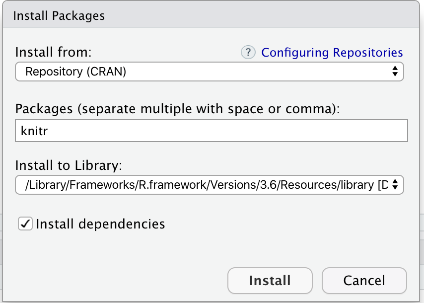
``` 
]

---

## Abrir / Criar um documento markdown


.pull-left[

```{r, echo=FALSE, fig.cap="", out.width = '100%', fig.align="center", fig.retina = 2, fig.pos='h'}
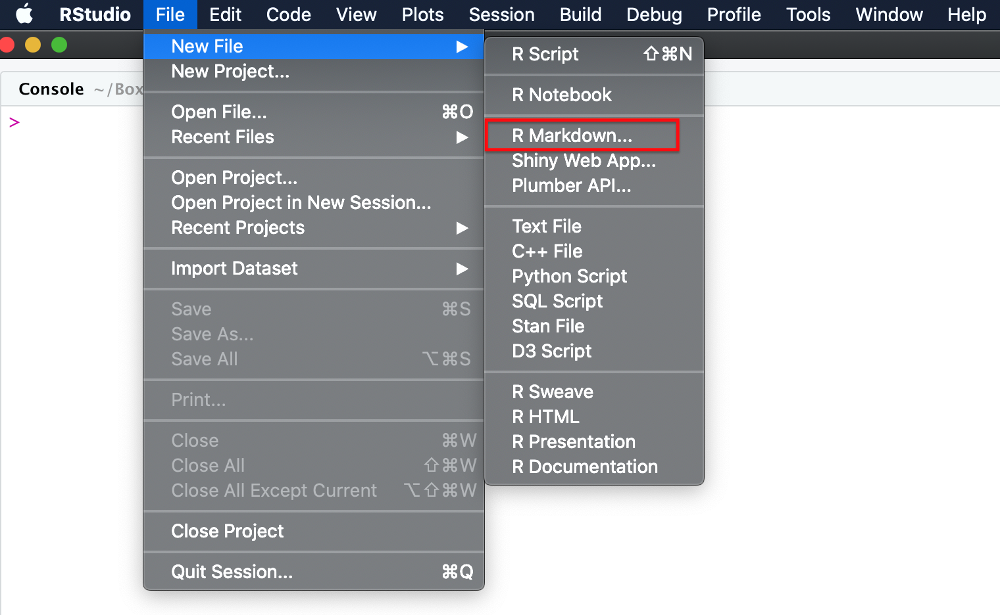
``` 
]

.pull-right[
```{r, echo=FALSE, fig.cap="", out.width = '100%', fig.align="center", fig.retina = 2, fig.pos='h'}
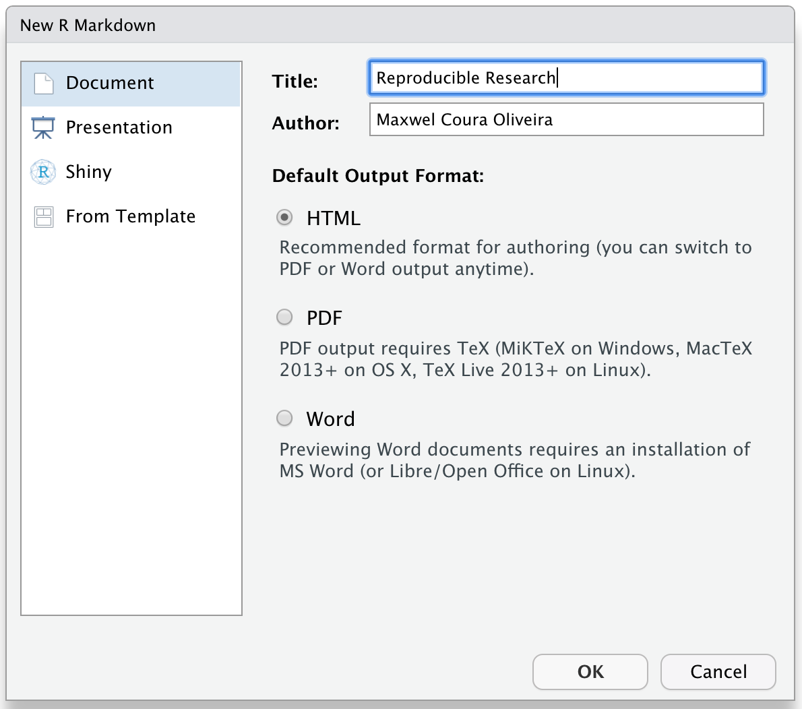
``` 
]


---

## Seções do R Markdown


```{r, echo=FALSE, fig.cap="", out.width = '100%', fig.align="center", fig.retina = 2, fig.pos='h'}
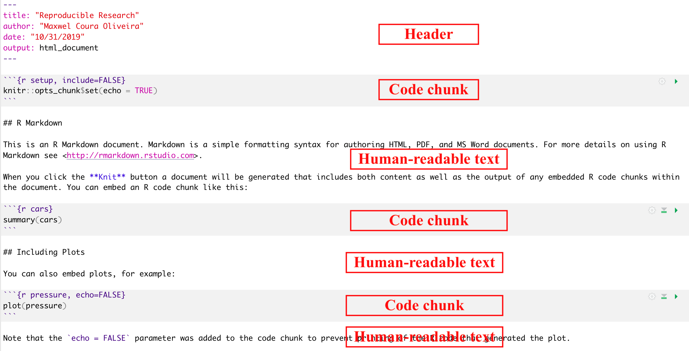
``` 


---

## Notebook interface


- Pressione o triângulo em um `code chunk` para executar o código e mostrar a saída (`output`)


```{r, echo=FALSE, fig.cap="", out.width = '100%', fig.align="center", fig.retina = 2, fig.pos='h'}
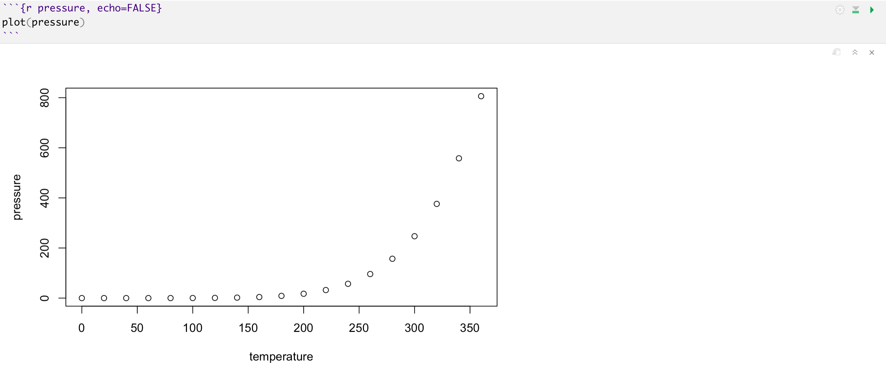
``` 


---

##  Knit: do texto para o documento


.pull-left[

render(input = “name.Rmd”, output = “html_document”)

**OU**


```{r, echo=FALSE, fig.cap="", out.width = '100%', fig.align="center", fig.retina = 2, fig.pos='h'}
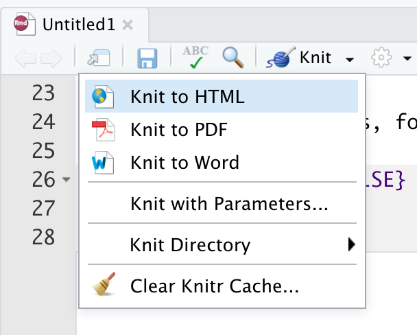
``` 
]


.pull-right[
```{r, echo=FALSE, fig.cap="", out.width = '100%', fig.align="center", fig.retina = 2, fig.pos='h'}
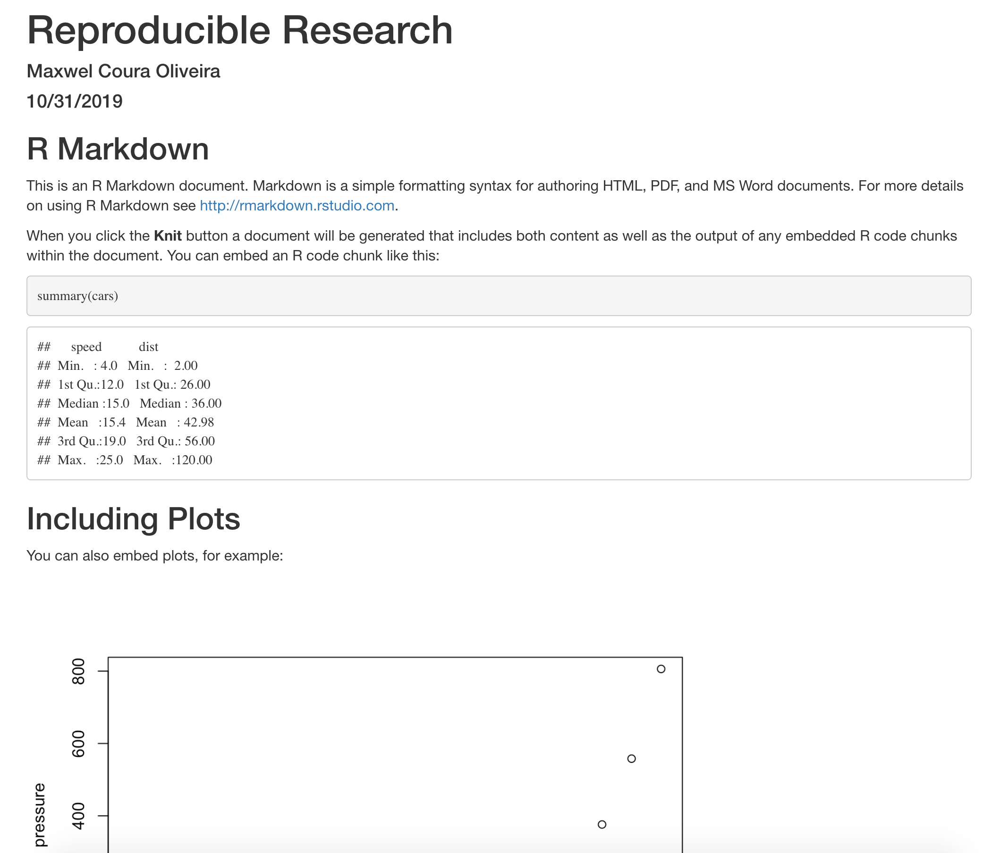
``` 
]

---

##  Como funciona?


- knitr package converte o **R Markdown** documento para markdown

- Pandoc converte o documento Markdown para o final

```{r, echo=FALSE, fig.cap="", out.width = '100%', fig.align="center", fig.retina = 2, fig.pos='h'}
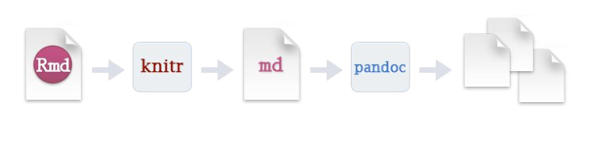
``` 

---

## Exercício 1: renderizar o documento

- Knit o documento 

- - Exclua tudo, exceto o cabeçalho (`header`)

- knit de novo

- O que mudou? Você teve algum problema?
 
---

##  Texto legível por humanos


.pull-left[

- Outline first, code 


- Use markdown rich formatting syntax to

- Cheat sheet: [Link](https://rstudio.com/wp-content/uploads/2015/02/rmarkdown-cheatsheet.pdf)
]

.pull-right[
```{r, echo=FALSE, fig.cap="", out.width = '100%', fig.align="center", fig.retina = 2, fig.pos='h'}
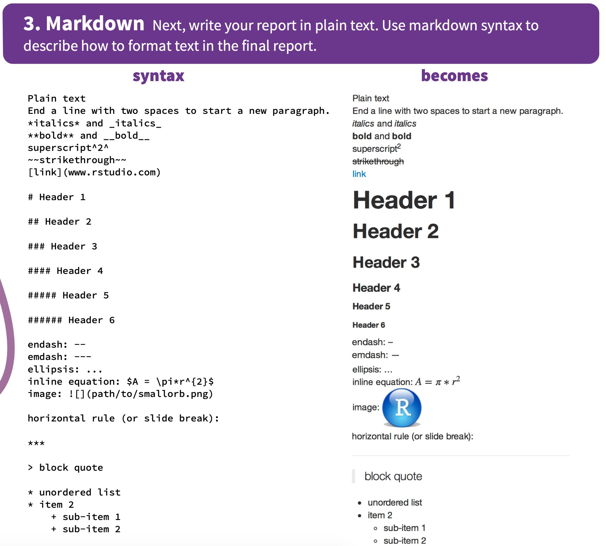
``` 
]


---

##  Exercise 2: escreva um esboço


- Veja o documento da folha de dicas (`cheat sheet`) 


- Escreva o texto abaixo em **Rmd** com todos os números em itálico e todos os nomes do Brasil em negrito. Escreva também o texto com Brasil como título e Nome, Área e Cidades como subtítulo. Fonte: [Wikipedia] (https://pt.wikipedia.org/wiki/Brasil)


Brasil

Nome

"Brasil, oficialmente República Federativa do Brasil, é o maior país da América do Sul e da região da América Latina, sendo o quinto maior do mundo em área territorial (equivalente a 47,3% do território sul-americano) e sexto em população (com mais de 210 milhões de habitantes)."

Área

Com 8,5 milhões de quilômetros quadrados (3,2 milhões de milhas quadradas) e mais de 208 milhões de habitantes, o Brasil é o quinto maior país do mundo em área e o quinto mais populoso.


---


##  Adding code chunks


- Delimitadores do Chunk 
 
    - inicio: ```{r name
    
    <code>
    
    - fim: ```

- Shortkey: Ctrl+Alt+i 

- Barra de ferramentas do editor


```{r, echo=FALSE, fig.cap="", out.width = '100%', fig.align="center", fig.retina = 2, fig.pos='h'}
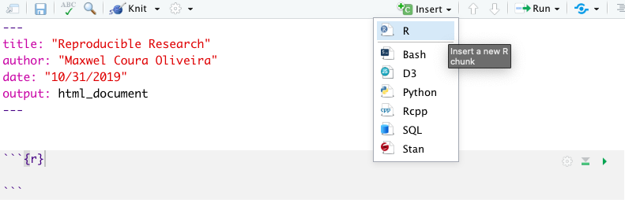
``` 


---

##  Setup code block

```
#load the libraries we need 
library(tidyverse) 
library(knitr)
```

```{r include=FALSE}
data <- read_csv("control.csv")
```

```{r, echo=FALSE, fig.cap="", out.width = '100%', fig.align="center", fig.retina = 2, fig.pos='h'}
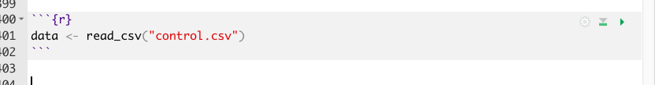
``` 


---


##  Code chunk options


- include = FALSE
  + Hide code and results from document 
  + results can still be used later
  
fig.pos='h'
- echo = FALSE
  + hides code, keeps result
  
fig.pos='h'
- message = FALSE 
  + hides messages 
  
fig.pos='h'
- warning = FALSE 
  + hides warnings
  
fig.pos='h'
- fig.cap = " " 
  + adds figure captions
 
---

##  Exercise 3: code chunk


.pull-left[

- insert a code block called graph
fig.pos='h'}
- Add the ggplot code
fig.pos='h'}
- Render
fig.pos='h'}
- Use options to hide the code
]

.pull-right[
```{r, out.width= '80%', warning=FALSE}
ggplot(data = data, aes(x = treat,
y = control, fill = treat)) +
  geom_bar(stat="summary") +
  coord_flip() +
  theme(legend.position = "none")
```
]


---


##  Setting options for all code chunks

- Set default options for all code chunks
fig.pos='h'}
- knitr::opts_chunk$set() function
fig.pos='h'}
- Put it in your first codeblock
fig.pos='h'}
- Must be after you load the rmarkdown package

---


## Tables


- Tables look like console output by default

- kable() function makes it pretty
 


```{r}
nd <- data %>% 
  group_by(treat) %>% 
  summarize(control = mean(control))
```

```{r}
kable(nd)
```


---

##  Inline code


- Syntax `r`

- Include in test for responsive text

- Allows you to write one report and run it over changing datasets

- Example: mean


```{r, echo=FALSE, fig.cap="", out.width = '100%', fig.align="center", fig.retina = 2, fig.pos='h'}
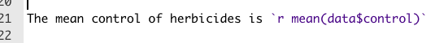
``` 


The mean control of herbicides is `r mean(data$control)`


---


## Change output formats

.pull-left[
- select output from knit menu
fig.pos='h'}
- Specify output in header
fig.pos='h'}
- with render
]

.pull-right[
```{r, echo=FALSE, fig.cap="", out.width = '60%', fig.align="center", fig.retina = 2, fig.pos='h'}
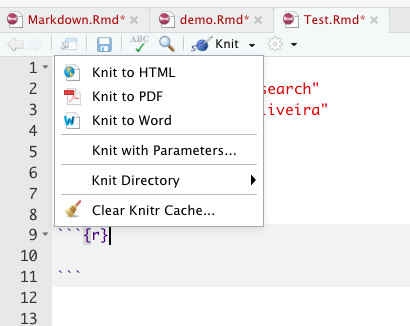
``` 


```{r, echo=FALSE, fig.cap="", out.width = '60%', fig.align="center", fig.retina = 2, fig.pos='h'}
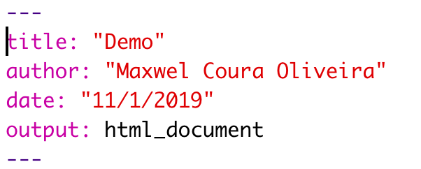
``` 


```{r, echo=FALSE, fig.cap="", out.width = '60%', fig.align="center", fig.retina = 2, fig.pos='h'}
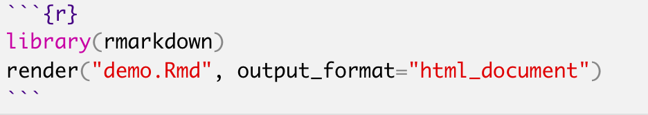
``` 
]

---


## Parameters


.pull-left[

- Creates custom report without having to change the code chunks
fig.pos='h'}
- Add to the header
fig.pos='h'}
- Creates a read only list of parameters
]

.pull-right[
```{r, echo=FALSE, fig.cap="", out.width = '80%', fig.align="center", fig.retina = 2, fig.pos='h'}
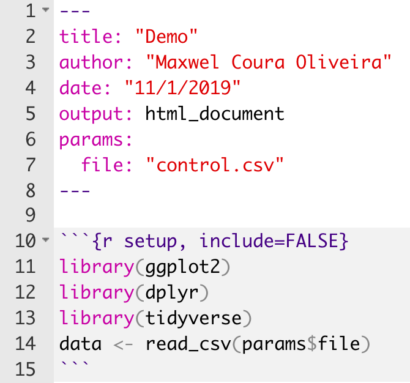
``` 
]

---


## Subset with parameters


.pull-left[


- Change the header to add a treat parameter

fig.pos='h'}

- Subset by treat using a filter statement in the setup code chunk

fig.pos='h'}

- Render
]

.pull-right[
```{r, echo=FALSE, fig.cap="", out.width = '80%', fig.align="center", fig.retina = 2, fig.pos='h'}
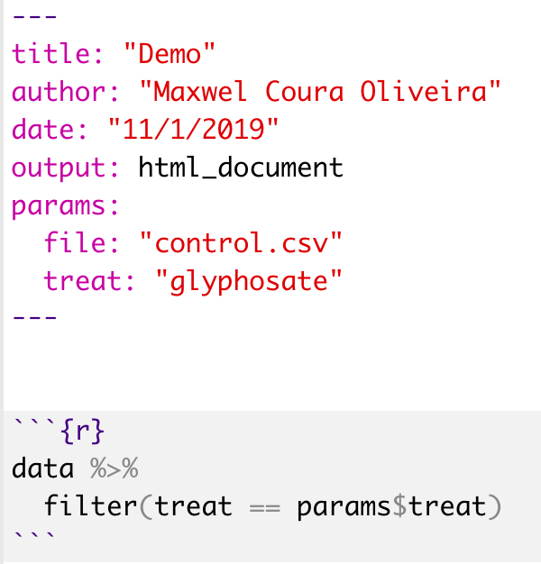
```
]


---

## Subset with parameters


.pull-left[


- params argument


- takes a list


- overrides default in the Rmd
]

.pull-right[
```{r, echo=FALSE, fig.cap="", out.width = '80%', fig.align="center", fig.retina = 2, fig.pos='h'}
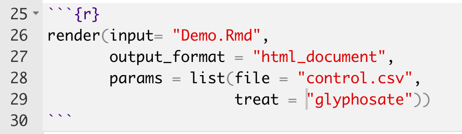
```
]

---

##  Parameter user interface

.pull-left[


- params = “ask”

- Opens up a web browser

- Select options

- Hit save

- Doc gets rendered
]

.pull-right[


]


---


##  Types of parameter input

- Parameterized reports: [Link](https://bookdown.org/yihui/rmarkdown/parameterized-reports.html)

```{r, echo=FALSE, fig.cap="", out.width = '100%', fig.align="center", fig.retina = 2, fig.pos='h'}
knitr::include_graphics("images/params3.png")
```

---

## More functions

- Customized **YAML** metadata

- Presentations

- Manuscripts

---

##  Summary


- Literate programming makes reproducible research more machine readable

- R markdown documents facilitate literate programming in RStudio

- R markdown has 3 sections
  - Header: determines output and adds parameters
  - Markdown Text: can include inline code
  - Code chunks: can be customized to mute code or output

- Parameters help you customize reports
 

---


## Need help?

- Email: max.oliveira@wisc.edu

- R markdown cheatsheet: [Link](https://www.rstudio.com/wp-content/uploads/2015/02/rmarkdown-che atsheet.pdf)

- R markdown tutorial: [Link](https://rmarkdown.rstudio.com/lesson-1.html)


