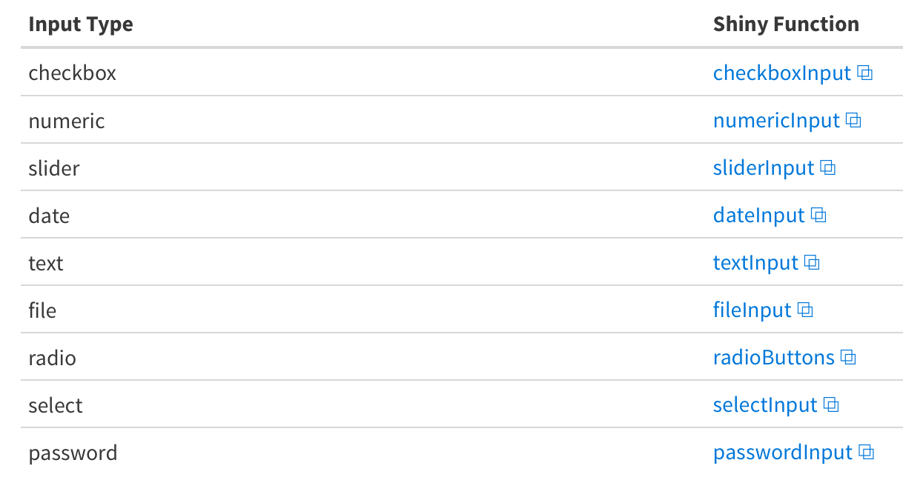

```{r include=FALSE}
library(tidyverse)
library(kableExtra)
```


## Outline

- O que é programação alfabetizada?

- Por que é útil?

- Como usar R Markdown para criar relatórios reproduzíveis
   - Formatação de texto
   - Pedaços de código (chunks)
   - Formatos de saída (outputs)
 

---

## Livro 

- [R Markdown: The Definitive Guide](https://bookdown.org/yihui/rmarkdown/)

```{r, echo=FALSE, fig.cap="", out.width = '40%', fig.align="center", fig.retina = 2, fig.pos='h'}
knitr::include_graphics("https://bookdown.org/yihui/rmarkdown/images/cover.png")
``` 

 
---

- O que é programação alfabetizada?

<center>

<br>
<br>
<br>

Texto legível por humanos

<br>
<br>

 +

<br>
<br>

Código legível por máquina

<br>
<br>

 =

<br>
<br>

Documento reproduzível

</center>


---


## Programas como obras de literatura

- Desenvolvido por Donald Knuth, Stanford University

- Tradicional: dizer a um computador o que fazer

- Novo: dizer a um humano o que você quer que o computador faça

- Melhora a documentação e os próprios programas
 
 
```{r, echo=FALSE, fig.cap="", out.width = '50%', fig.align="center", fig.retina = 2, fig.pos='h'}
knitr::include_graphics("https://cdn.thenewstack.io/media/2017/12/4d1c7903-knuth.jpg")
``` 
 
---


## Programação alfabetizada em pesquisa

.pull-left[

- Personalize relatórios para um público

- Repetível e garante reprodutibilidade

- Funciona bem com controle de versão (Git)

- Funciona bem com as linguaguens usadas na pesquisa:

]

.pull-right[

```{r, echo=FALSE, fig.cap="", out.width = '50%', fig.align="center", fig.retina = 2, fig.pos='h'}
knitr::include_graphics("https://jupyter.org/assets/main-logo.svg")
``` 


```{r, echo=FALSE, fig.cap="", out.width = '50%', fig.align="center", fig.retina = 2, fig.pos='h'}
knitr::include_graphics("https://upload.wikimedia.org/wikipedia/commons/thumb/4/48/Markdown-mark.svg/1200px-Markdown-mark.svg.png")
``` 
]


---


## R Markdown


- Tece texto narrativo e código
  - R
  - Python 
  - Stata
  - SAS
  
- Produz documentos em muitos formatos

- Reproduzível


```{r, echo=FALSE, fig.cap="", out.width = '30%', fig.align="center", fig.retina = 2, fig.pos='h'}
knitr::include_graphics("http://cdn.differencebetween.net/wp-content/uploads/2019/02/Difference-Between-Python-and-R-Machine-Learning--768x595.png")
``` 

---

## Configuração

.pull-left[

- Tools > install packages OU install.packages("markdown")

- Instale o pacote tinytex para criar PDFs

- Abra o projeto **R**
]

.pull-right[
```{r, echo=FALSE, fig.cap="", out.width = '100%', fig.align="center", fig.retina = 2, fig.pos='h'}
knitr::include_graphics("images/knitr.png")
``` 
]

---

## Abrir / Criar um documento markdown


.pull-left[

```{r, echo=FALSE, fig.cap="", out.width = '100%', fig.align="center", fig.retina = 2, fig.pos='h'}

``` 
]

.pull-right[
```{r, echo=FALSE, fig.cap="", out.width = '100%', fig.align="center", fig.retina = 2, fig.pos='h'}
knitr::include_graphics("images/newdoc.png")
``` 
]


---

## Seções do R Markdown


```{r, echo=FALSE, fig.cap="", out.width = '100%', fig.align="center", fig.retina = 2, fig.pos='h'}

``` 


---

## Notebook interface


- Pressione o triângulo em um `code chunk` para executar o código e mostrar a saída (`output`)


```{r, echo=FALSE, fig.cap="", out.width = '100%', fig.align="center", fig.retina = 2, fig.pos='h'}
knitr::include_graphics("images/run.png")
``` 


---

##  Knit: do texto para o documento


.pull-left[

render(input = “name.Rmd”, output = “html_document”)

**OU**


```{r, echo=FALSE, fig.cap="", out.width = '100%', fig.align="center", fig.retina = 2, fig.pos='h'}
knitr::include_graphics("images/html.png")
``` 
]


.pull-right[
```{r, echo=FALSE, fig.cap="", out.width = '100%', fig.align="center", fig.retina = 2, fig.pos='h'}
knitr::include_graphics("images/output.png")
``` 
]

---

##  Como funciona?


- knitr package converte o **R Markdown** documento para markdown

- Pandoc converte o documento Markdown para o final

```{r, echo=FALSE, fig.cap="", out.width = '100%', fig.align="center", fig.retina = 2, fig.pos='h'}
knitr::include_graphics("images/pandoc.png")
``` 

---

## Exercício 1: renderizar o documento

- Knit o documento 

- - Exclua tudo, exceto o cabeçalho (`header`)

- knit de novo

- O que mudou? Você teve algum problema?
 
---

##  Texto legível por humanos


.pull-left[

- Outline first, code 


- Use markdown rich formatting syntax to

- Cheat sheet: [Link](https://rstudio.com/wp-content/uploads/2015/02/rmarkdown-cheatsheet.pdf)
]

.pull-right[
```{r, echo=FALSE, fig.cap="", out.width = '100%', fig.align="center", fig.retina = 2, fig.pos='h'}

``` 
]


---

##  Exercise 2: escreva um esboço


- Veja o documento da folha de dicas (`cheat sheet`) 


- Escreva o texto abaixo em **Rmd** com todos os números em itálico e todos os nomes do Brasil em negrito. Escreva também o texto com Brasil como título e Nome, Área e Cidades como subtítulo. Fonte: [Wikipedia] (https://pt.wikipedia.org/wiki/Brasil)


Brasil

Nome

"Brasil, oficialmente República Federativa do Brasil, é o maior país da América do Sul e da região da América Latina, sendo o quinto maior do mundo em área territorial (equivalente a 47,3% do território sul-americano) e sexto em população (com mais de 210 milhões de habitantes)."

Área

Com 8,5 milhões de quilômetros quadrados (3,2 milhões de milhas quadradas) e mais de 208 milhões de habitantes, o Brasil é o quinto maior país do mundo em área e o quinto mais populoso.


---


##  Adding code chunks


- Delimitadores do Chunk 
 
    - inicio: ```{r name
    
    <code>
    
    - fim: ```

- Shortkey: Ctrl+Alt+i 

- Barra de ferramentas do editor


```{r, echo=FALSE, fig.cap="", out.width = '100%', fig.align="center", fig.retina = 2, fig.pos='h'}

``` 


---

##  Configuração od bloco de código (`chunk`)

```{r message=FALSE, echo=TRUE}
#load the libraries we need 
library(tidyverse) 
library(knitr)
```

```{r message=FALSE, echo=TRUE}
data <- read_csv("control.csv")
```


---


##  Code chunk options


- include = FALSE
  + Oculta código e resultados do documento 
  + Resultados ainda podem ser usados mais tarde
  

- echo = FALSE
  + esconde o código, mantém o resultado
  

- message = FALSE 
  + hides messages 
  

- warning = FALSE 
  + esconde avisos
  

- fig.cap = " " 
  + adiciona títulos de figuras
 
---

##  Exercício 3: code chunk


.pull-left[

- insira un bloco de código (`chunk`) com o nome de gráfico

- Adicione o código ggplot

- Renderizar

- Use opções para ocultar o código
]

.pull-right[
```{r, out.width= '80%', message=FALSE}
ggplot(data = data, aes(x = treat,
y = control, fill = treat)) +
  geom_bar(stat="summary") +
  coord_flip() +
  theme(legend.position = "none")
```
]


---


## Opções de configuração para todos os blocos de código (`chunk`)

- Defina as opções padrão para todos os blocos de código

- função knitr::opts_chunk$set() 

- Coloque-o no seu primeiro bloco de código

- Deve ser depois de carregar o pacote rmarkdown

```{r}
knitr::opts_chunk$set(message = FALSE) 
```


---


## Tabelas


- As tabelas parecem com a saída (`output`) do console por padrão

- função kable() torna a tabela bonita
 
```{r echo=TRUE, message=FALSE}
library(kableExtra)
```


```{r}
nd <- data %>% 
  group_by(treat) %>% 
  summarize(control = mean(control))
```

```{r}
kable(nd)
```


---

##  Código inline 


- Sintaxe `r`

- Incluir no teste de texto responsivo

- Permite que você escreva um relatório e execute-o em conjuntos de dados variáveis

- Exemplo: média


<br>

A média do controle de herbicidas é `r mean(data$control)`


```{r, echo=FALSE, fig.cap="", out.width = '100%', fig.align="center", fig.retina = 2, fig.pos='h'}
knitr::include_graphics("images/inline.png")
``` 


---


## Mude os formatos de saída (`output`)

.pull-left[

- selecione a saída (`output`) do menu knit

```{r, echo=FALSE, fig.cap="", out.width = '100%', fig.align="center", fig.retina = 2, fig.pos='h'}

``` 


]

.pull-right[

- Especifique a saída no cabeçalho

```{r, echo=FALSE, fig.cap="", out.width = '100%', fig.align="center", fig.retina = 2, fig.pos='h'}
knitr::include_graphics("images/yalm.png")
``` 


- com render


```{r, echo=FALSE, fig.cap="", out.width = '100%', fig.align="center", fig.retina = 2, fig.pos='h'}

``` 
]

---


## Parameters


.pull-left[

- Creates custom report without having to change the code chunks
fig.pos='h'}
- Add to the header
fig.pos='h'}
- Creates a read only list of parameters
]

.pull-right[
```{r, echo=FALSE, fig.cap="", out.width = '80%', fig.align="center", fig.retina = 2, fig.pos='h'}

``` 
]

---


## Subconjunto com parâmetros


.pull-left[


- Altere o cabeçalho para adicionar um parâmetro de tratamento (treat)


- Subconjunto por tratamento (treat) usando uma instrução de filtro no fragmento do código de configuração


- Render
]

.pull-right[
```{r, echo=FALSE, fig.cap="", out.width = '80%', fig.align="center", fig.retina = 2, fig.pos='h'}

```
]


---

## Subconjunto com parâmetros


.pull-left[


- Argumento params 


- Pega uma lista (list)


- substitui o padrão no Rmd
]

.pull-right[
```{r, echo=FALSE, fig.cap="", out.width = '80%', fig.align="center", fig.retina = 2, fig.pos='h'}

```
]

---

##  Parameter user interface

.pull-left[


- params = “ask”

- Abre um navegador da web

- Selecione as opções

- Clique em Salvar

- Doc é renderizado
]

.pull-right[


]


---


##  Tipos de parâmetros de entrada

- Relatórios parametrizados: [Link](https://bookdown.org/yihui/rmarkdown/parameterized-reports.html)

```{r, echo=FALSE, fig.cap="", out.width = '100%', fig.align="center", fig.retina = 2, fig.pos='h'}

```

---

## Mais funções

- Metadados ** YAML ** personalizados

- Apresentações

- Manuscritos

---

##  Summary


- A programação alfabetizada torna a pesquisa reproduzível mais legível por uma máquina

- Documentos de R markdown facilitam a programação literária no RStudio

- O R markdown tem 3 seções
   - **Cabeçalho:** determina a saída e adiciona parâmetros
   - **Texto Markdown:** pode incluir código embutido
   - **Pedaços de código:** podem ser personalizados para silenciar o código ou saída

- Os parâmetros ajudam a personalizar relatórios
 

---


## Precisa de ajuda?

- Email: maxweloliveira@unoeste.br

- R markdown cheatsheet: [Link](https://www.rstudio.com/wp-content/uploads/2015/02/rmarkdown-che atsheet.pdf)

- R markdown tutorial: [Link](https://rmarkdown.rstudio.com/lesson-1.html)


