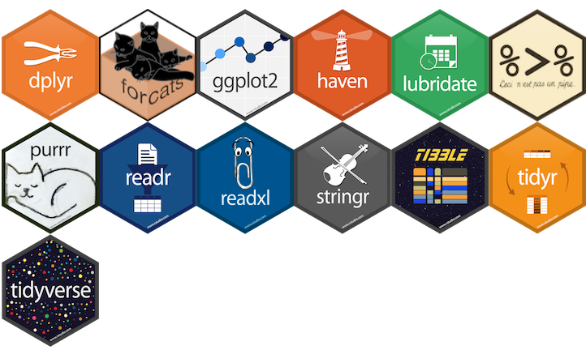
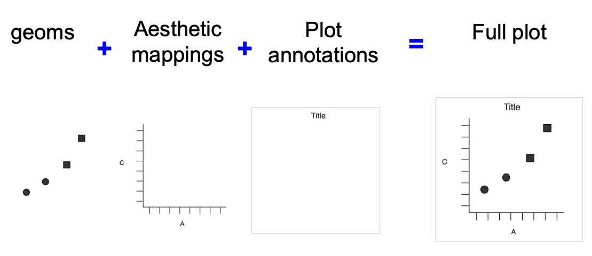
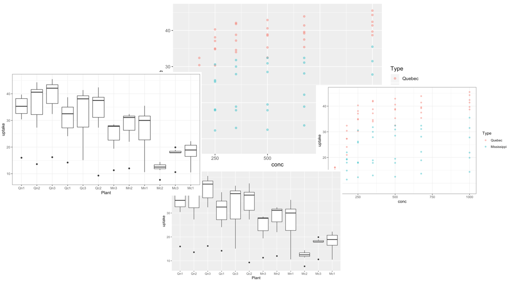
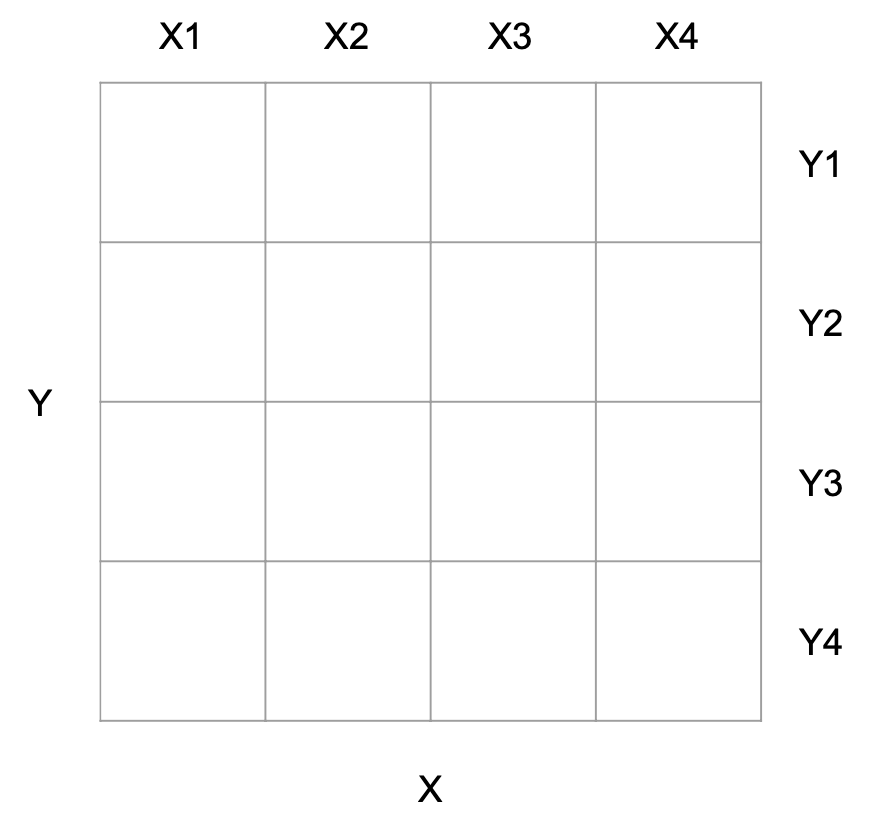

```{r include=FALSE}
library(tidyverse)
```


## Outline

- Por quê ggplot2?

- Elementos básicos (dados, estética, geoms)

- Modificações (transparência, cor, agrupamento, temas)

- Exportando plotagens (ggsave)


---


##  Por quê ggplot2?


- Reprodutibilidade

- Parte do tidyverse

- Bonito por padrão

- Customizável
 

 
```{r, echo=FALSE, fig.cap="", out.width = '60%', fig.align="center", fig.retina = 2, fig.pos='h'}

```
 

---


## Data set: CO<sub>2</sub>

.pull-left[

A absorção de CO<sub>2</sub> de seis plantas de Quebec/CAN e seis plantas de Mississippi/EUA foi medida em vários níveis de concentração de CO<sub>2</sub> no ambiente. Metade das plantas de cada tipo foram resfriadas durante a noite antes do experimento ser conduzido.

]

.pull-right[

- Armazenado em um arquivo .csv

- *Linhas*: observações de cada planta

- *Colunas*: Variáveis que descrevem o experimento
  - Plant, Type, Treatment, conc, and uptake

]


```{r, echo=FALSE, fig.cap="", out.width = '50%', fig.align="center", fig.retina = 2, fig.pos='h'}

```


---

## ggplot2 faz plotagens modulares


```{r, echo=FALSE, fig.cap="", out.width = '100%', fig.align="center", fig.retina = 2, fig.pos='h'}

```


---

## “Gramática” dos gráficos ggplot2

- **dados:** os dados que você deseja "plotar"

- **Mapeamentos estéticos:** mapeamento de variáveis para os eixos

- **geoms:** como você deseja que os dados sejam desenhados
   - Ex: pontos, linhas, barras
 
- **ggplot():** cria um objeto ggplot

- **aes():** desenha eixos com base em argumentos

- **geom_XXX():** desenha pontos/linhas etc

- **+:** adiciona componentes ao gráfico
   - Estrutura modular

 
---


## Exemplo

```{r include=FALSE}
orange <-read_csv("orange.csv")
```

- Orange dataset from previous examples (data wrangling)

```{r echo=FALSE, out.width= '50%', fig.align='center'}
library(datasets)
orange$tree <- factor(orange$tree)
ggplot(orange, aes(x=age, y=circumference, color=tree)) +
  geom_point() +  theme_bw()
```


---

## Plotting data


- ggplot():
   - tabela de dados para "plotar"
   - função mapeamento = aes()
   - variável do eixo x
   - variável do eixo y

- geom() - como desenhar os dados
 


```{r, out.width= '30%', fig.align='center'}
ggplot(data=CO2, 
       aes(x=conc, y=uptake)) +
  geom_point()
```

 

---


## Modificando ggplots


- Cor e transparência

- Outros geoms

- Temas


```{r, echo=FALSE, fig.cap="", out.width = '100%', fig.align="center", fig.retina = 2, fig.pos='h'}

``` 


---

## Specifying data


.pull-left[

- ggplot (): Cria um objeto de plotagem

- **Input**: tabela de dados

- **Output**: plotagem em branco
]


.pull-right[
```{r out.width = '100%', fig.align="center"}
ggplot(data = CO2)
```
]

---


## Mapeamentos estéticos

.pull-left[
- Desenhe os eixos

- **Input**:
   - argumento de mapeamento
   - função aes ()
   - x = variável do eixo x
   - y = variável do eixo y

- **Output**: plot with axes, no data
]

.pull-right[
```{r out.width = '100%', fig.align="center"}
ggplot(data = CO2,
  mapping = aes(x=conc, 
                y=uptake))
```
]


---


## Geometrias

.pull-left[
- *geom_point()*: desenha pontos dos dados

- **Input**: função *geom_*
  - requer o operador **+**
  - Espaço em branco é importante

- **Output**: gráfico de dispersão

]


.pull-right[
```{r}
ggplot(data = CO2,
  mapping = aes(x=conc, 
                y=uptake)) +
  geom_point()
```
]


---


## Modificando ggplots

.pull-left[
- **Cor e transparência**

- Outros geoms

- Temas
]


.pull-right[
```{r}
ggplot(data = CO2,
  mapping = aes(x=conc, 
                y=uptake, 
                color=Plant)) +
  geom_point()
```
]


---


## Adicionar transparência


.pull-left[
- Adicionar argumento a geom_point()

- Reduz a transparência dos pontos

- **Input**: alpha} = 0.1 
  - opacidade 1/10 
  - Alcance: 0-1
]

.pull-right[
```{r}
ggplot(data = CO2,
  mapping = aes(x=conc, 
                y=uptake,
                color=Plant)) +
  geom_point(alpha=0.1) 
```
]


---

## Adicionar cor

.pull-left[
- Altere as cores dos pontos para azul

- **Input**: argumento de cor (blue)
  - Tabela de referência de cores: [Link](http://sape.inf.usi.ch/quick-refe rence/ggplot2/colour)
  - **Output**: pontos azuis
]

.pull-right[
```{r}
ggplot(data = CO2,
  mapping = aes(x=conc, 
                y=uptake)) +
  geom_point(alpha=0.5, 
             color="blue") 
```
]


---


## Adicionar cor por tipo (local)

.pull-left[
- Pontos de cor por variável

- Input: cor = <variável de fator>

- Deve estar dentro de aes()
  - Qualquer coisa que faça referência ao conjunto de dados
  - Como variáveis x e y

- **Output**: um gráfico colorido

]

.pull-right[
```{r}
ggplot(data = CO2,
  mapping = aes(x=conc, 
                y=uptake,
                color=Plant)) +
  geom_point(alpha=0.5)
```
]


---

## Exercício 1

- Use o exemplo anterior como ponto de partida. 

- Adicione cor aos pontos de dados de acordo com a planta da qual a amostra foi retirada (planta)


```{r echo=FALSE, out.width = '50%', fig.align="center"}
ggplot(data = CO2,
  mapping = aes(x=conc, 
                y=uptake,
                color=Type)) +
  geom_point()
```

---


## Modificando ggplots


- Color and transparency

- **Outros geoms**
  - Dados categóricos
  - Série temporal

- **Temas**


```{r, echo=FALSE, fig.cap="", out.width = '80%', fig.align="center", fig.retina = 2, fig.pos='h'}

```


---


## Plotando categorias

.pull-left[
-  geom_point não funciona para tudo
  - Overplotted
  - Como podemos espalhar os dados?

- Use um geom diferente:
  - geom_jitter()
]


.pull-right[
```{r}
ggplot(data = CO2,
  mapping = aes(x=Type, 
                y=uptake)) +
  geom_jitter()
```
]

---


## geom_jitter


.pull-left[
- geom_jitter() - espalha os pontos

- Melhor, mas ainda overplotted

- Que tipo de plot se parece?

]


.pull-right[
```{r}
ggplot(data = CO2,
  mapping = aes(x=Type, 
                y=uptake)) +
  geom_jitter(alpha=0.2)
```
]


---


## Box plots

.pull-left[
-Categórico vs. numérico

- geom_boxplot() - desenha um boxplot
  - Mediana - linha do meio
  - Quartis - borda do plot
  - Outliers - pontos fora do plot

- Mostra melhor a disseminação dos dados
]


.pull-right[
```{r}
ggplot(data = CO2,
  mapping = aes(x=Type, 
                y=uptake)) +
  geom_boxplot()
```
]


---


## Camadas de geoms


.pull-left[
- Use o operador **+** para sobrepor geoms
]


.pull-right[
```{r}
ggplot(data = CO2,
  mapping = aes(x=Type, 
                y=uptake)) +
  geom_boxplot() +
  geom_jitter(alpha=0.5,
              color="tomato")
```
]


---


## A ordem importa

.pull-left[
- Ordem inversa dos geoms

]


.pull-right[
```{r}
ggplot(data = CO2,
  mapping = aes(x=Type, 
                y=uptake)) +
  geom_jitter(alpha=0.5,
              color="tomato") +
  geom_boxplot() 
```
]


---

## Exercise 2: plot violino


- Plote os mesmos dados do exemplo anterior, mas como um gráfico de violino

  - Hint: veja *geom_violin()*.
 
- Que informações sobre os dados esse gráfico violino oferece?


---


## Gráfico temporal


.pull-left[
- Visualize tendências ao longo do tempo

- Normalmente uma estatística resumida

- Provavelmente necessário remodelar os dados

- Considere quais variáveis você precisa para construir o gráfico
]


```{r include=FALSE}
phones <- read_csv("phones.csv")
```


.pull-right[
```{r echo=FALSE}
ggplot(data = phones,
  mapping = aes(x=year, 
                y=number, 
                group=location)) +
  geom_line(aes(col=location))
```
]


---


## Dados de série temporal


.pull-left[
- Carregue os telefones do conjunto de dados

- Conjunto de dados: Número de telefones em cada continente de 1951 a 1961
]

.pull-right[
```{r warning=FALSE}
phones <- read_csv("phones.csv")
phones
```
]


---


## Dados de série temporal


.pull-left[
- Use geom_line()

- Input ao ggplot()
  - dados = phones
  - x = year
  - y = number (# observações)
]


.pull-right[
```{r }
ggplot(data = phones,
  mapping = aes(x=year, 
                y=number)) +
  geom_line()
```
]


---


## agrupar por localion


.pull-left[
- Crie uma linha para cada local

- **Input** 
  - argumento aes(): group

- Mas que linha é qual localização?
]


.pull-right[
```{r }
ggplot(data = phones,
  mapping = aes(x=year, 
                y=number, 
  group=location)) +
  geom_line()
```
]


---


## Create a legend


.pull-left[
- Adicione cor para gerar uma legenda automaticamente


- argumento aes(): color


]


.pull-right[
```{r}
ggplot(data = phones,
  mapping = aes(x=year, 
                y=number, 
  color=location)) +
  geom_line()
```
]


---


## Salvar ggplots em uma variável


.pull-left[
- Salva ggplot como uma lista

- Para renderizar um gráfico salvo, envie o nome do gráfico para o console

- Pode adicionar o gráfico ou usá-lo para exportá-lo para um arquivo
]


.pull-right[
```{r}
lineplot <- ggplot(data = phones,
  mapping = aes(x=year, y=number, 
  color=location)) +
  geom_line()
lineplot
```
]


---


## Criação de gráficos de qualidade de publicação


.pull-left[
- gráfico de linha

```{r echo=FALSE}
ggplot(data = phones,
  mapping = aes(x=year, y=number, 
        color=location)) +
  geom_line()
```
]

.pull-right[
- gráfico de linha + theme_XX()


```{r echo=FALSE}
ggplot(data = phones,
  mapping = aes(x=year, y=number, 
  color=location)) +
  geom_line() + theme_bw() + 
  labs(y="Number of phones", x="Year",
  title="Telephones in the world")
```
]


---


## Aplicando temas feitos previamente

.pull-left[

- Feitos previamente
  - Ex: theme_bw()
  - Lista de temas em help (?theme)
  
- Aplicar tema usando o operador **+**

- Bônus: pacote *ggthemes*
]


.pull-right[
- gráfico de linha + theme_XX()


```{r}
linebw <- lineplot + theme_bw() 
linebw
```
]


---


## Personalizar rótulos de eixo


.pull-left[
- Padrão: nomes de variáveis como do eixo x e y
  
- labs() - especificar nomes
   - título: título do gráfico
   - nome do eixo x: x
   - nome do eixo y: y


- Fornece um texto mais descritivo
]


.pull-right[
```{r}
new_fig <- linebw + 
  labs(y="Number of phones", x="Year", 
       title="Telephones in the world")
new_fig
```
]


---


## Personalize o tamanho da fonte


.pull-left[
- *tema ()* - ajustes finos para o tema
   - Usado com elementos de tema
   - Ex: text size

- *element_text()*
   - size - tamanho do texto
   - family - fonte
  
-? margin para mais elementos do tema ggplot


```{r}
new_fig <- new_fig + 
theme(text=element_text(size=16))

new_fig
```
]


.pull-right[

## Crie seu próprio tema


- Salve seu tema em um objeto de lista

- Pode ser aplicado a qualquer gráfico

- Certifique-se de incluir apenas elementos de tema, não geoms etc.


```{r}
theme_nd <- theme_bw() +
theme(text = element_text(size=16)) 
# add font="Arial"
```
]

---

## Aplique seu tema


```{r, out.width='60%', fig.align='center'}
box <- ggplot(data = phones,
  mapping = aes(x=year, y=number, 
    color=location)) +
  geom_boxplot() + theme_nd 

box
```


---

## Organizando os gráficos

.pull-left[
- Sem função em ggplot2

- Use the cowplot library

- plot_grid()
  - Plots to arrange
  - Ncols - number of columns
  - Labels 

- See ?plot_grid


```{r}
library(cowplot)
```
]


.pull-right[
```{r }
plot_grid(new_fig, box,
          ncol=2, 
          labels =c("A", "B"))
```
]


---

## Arranging plots


.pull-left[

- Plot window > Export

- ggsave(): salva o gráfico em um arquivo
  - filename - nome do novo arquivo
  - plot - plot to be saved
  - device - gráfico a ser salva
  - dpi - qualidade da imagem
  - width - width of output
  - height - height of output 
]

.pull-right[
```
ggsave(filename = "name.png", 
plot = box, dpi = 600,
units = "in", width = 15, 
height = 10)
```
]

---

## Facetamento

.pull-left[

- Divide um gráfico em vários com base em um fator

- facet_XXX() - especifica o layout dos painéis

- **~** - formula 

- x **~** y
]


.pull-right[
```{r, echo=FALSE, fig.cap="", out.width = '100%', fig.align="center", fig.retina = 2, fig.pos='h'}

``` 
]

---

## facet_wrap

.pull-left[
- Faceta em uma variável

- *facet_wrap()* - envolve os painéis horizontalmente, se ajusta à tela

- Argumento: **~** y
]


.pull-right[

```{r}
ggplot(phones, aes(x=year, y=number,
  group=location)) +
  geom_line() +
  facet_wrap(~location)
```
]


---

##  Cor por location


.pull-left[
- Adiciona dimensionalidade ao gráfico
]


.pull-right[
```{r}
ggplot(phones, aes(x=year, y=number,
  color=location)) +
  geom_line() +
  facet_wrap(~location)
```
]


---

##  facet_grid

.pull-left[

- Especifique o seu layout

]


.pull-right[
```{r}
ggplot(phones, aes(x=year, y=number,
  color=location)) +
  geom_line() +
  facet_grid(location ~ .)
```
]

---

##  facet_grid

.pull-left[
- Mudança de orientação

]


.pull-right[
```{r}
ggplot(phones, aes(x=year, y=number,
  color=location)) +
  geom_line() +
  facet_grid(.~location)
```
]

---

## Precisa de ajuda?

- **Email**: max.oliveira@wisc.edu

- Repositório Github: [Link](https://github.com/maxwelco)

- Data Visualization cheat sheet: [Link](https://rstudio.com/wp-content/uploads/2015/03/ggplot2-cheatsheet.pdf)


