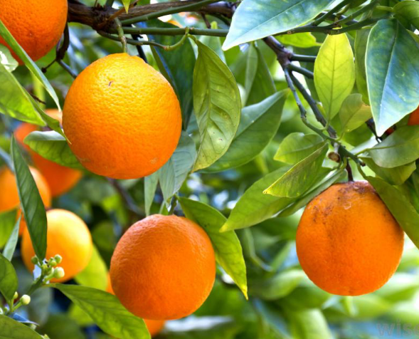
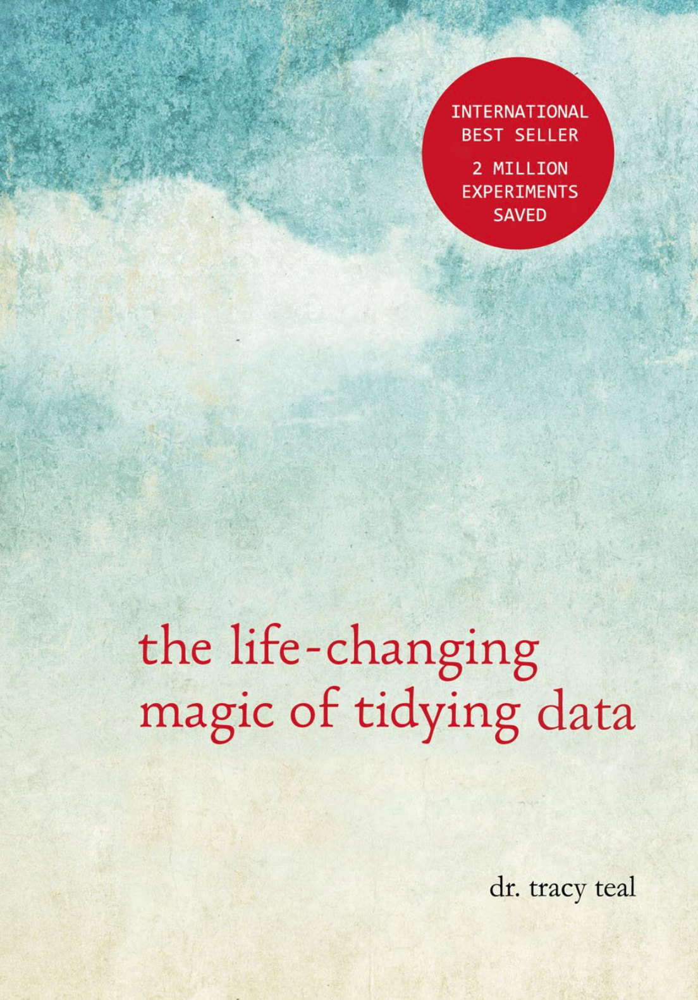
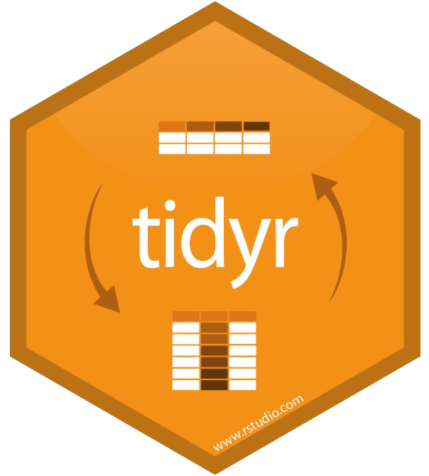
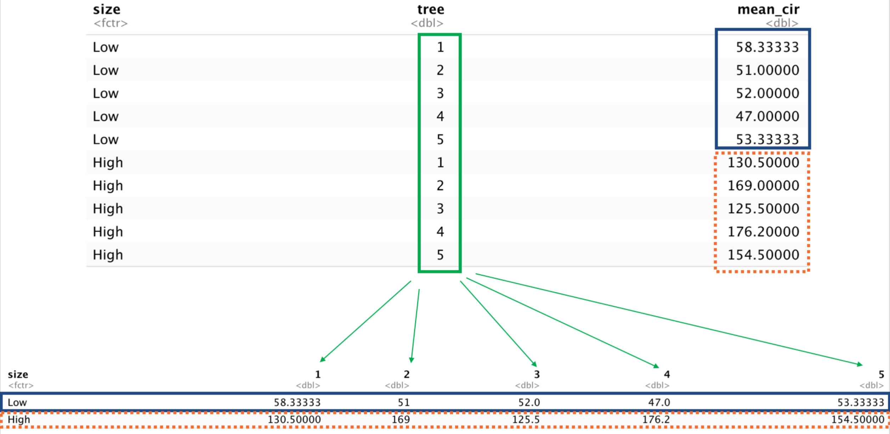
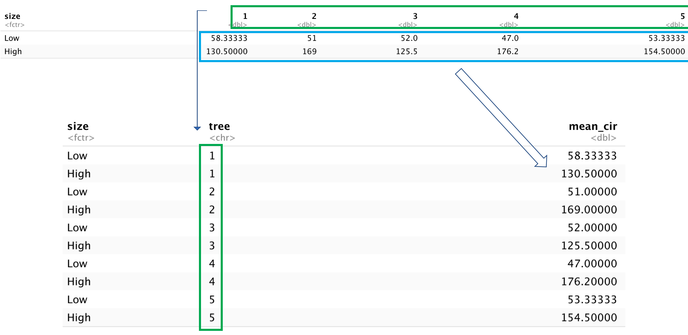

## Outline

- 7 verbos do *dplyr* para manipulação de dados
  - select, filter, group_by, summarize, mutate, count, arrange
  
- Combinando verbos usando pipes **%>%**
  
- 2 verbos tidyr para remodelar seus dados (pivot_longer, pivot_wider)

---
  
##  Cheat sheet
  
- [Data Wrangling with dplyr and tidyr](https://rstudio.com/wp-content/uploads/2015/02/data-wrangling-cheatsheet.pdf)


```{r, echo=FALSE, fig.cap="", out.width = '70%', fig.align="center", fig.retina = 2, fig.pos='h'}
knitr::include_graphics("https://audhalbritter.com/wp-content/uploads/2016/07/Bildschirmfoto-2016-07-25-um-23.13.54.png")
```


---

##  O que é tidyverse?

- Pacotes para manipulação de dados

- Construído para manipulação de dados

- Torna a manipulação de dados mais fácil do que na base R

- Combina verbos usando pipes
 

 
```{r, echo=FALSE, fig.cap="", out.width = '70%', fig.align="center", fig.retina = 2, fig.pos='h'}
knitr::include_graphics("images/tidyverse.png")
```
 

---


##  Instalando os pacotes (packages)


- install.packages()

- Input: nome do pacote

- Baixe os pacotes do CRAN (Comprehensive R Archive Network)

- Instale apenas uma vez


```{r, warning=FALSE}
#install.packages("tidyverse")
```


```{r, echo=FALSE, fig.cap="", out.width = '50%', fig.align="center", fig.retina = 2, fig.pos='h'}
knitr::include_graphics("https://media.giphy.com/media/128MHrlrHNwwU0/giphy.gif")
```
---

## Carregando pacotes


- library()

- Input: nome do pacote

- Dá acesso ao R para funções no pacote

- Carregue os pacotes sempre que reiniciar o R


```{r}
library(tidyverse)
```


---


## Dados: orange circunference

.pull-left[

- Armazenado em arquivo .csv

- *Linhas*: observação individual de uma laranja

- *Colunas*: variáveis que descrevem o experimento
  - expunit, tree, age, circunference
  
]

.pull-right[

```{r, echo=FALSE, fig.cap="", out.width = '100%', fig.align="center", fig.retina = 2, fig.pos='h'}

```
]

---


##  Importando os dados em tidyverse


- *read_csv()* – importa o conteúdo do arquivo CSV


- *Input*: caminho (a file path)


- *Output* um “tibble”


```{r include=FALSE}
orange <- read_csv("orange.csv")
```

```{r}
read_csv("orange.csv")
```


---

##  Por quê não read.csv()?


- read_csv() é mais rápido


- Cria tibbles


- Mais reproduzível
 


| Data frame           | Tibble                        |
|----------------------|-------------------------------|
| Strings to factors   | Keeps character               |
| Has row names        | No row names                  |
| Changes column names | Keeps column nas as they are  |


---


## verbos dplyr


- O primeiro argumento é sempre uma tabela
   - Tibble ou data frame

- Output é uma nova tabela

- Não altera os dados deo input
   - Deve salvar o output usando <-
  

```python
novo_df <- verb(velho_df, ... )

ou

velho_df <- verb(velho_df, ... )
```


---

##  select()

.pull-left[

- Seleciona colunas de um data frame

- Input: dados e colunas a serem mantidos

- Output: dados com apenas as colunas especificadas


```{r}
select(orange, age)
```

]

.pull-right[

**O mesmo que**


```{r}
tibble(orange$age)
```

]

---


## filter()

.pull-left[

- Escolhe as linhas com base nos valores de uma variável

- **Input**: dados e uma expressão lógica (retorna (retorna true/false)
    - <, >, >=, <=, ==, !=

- **Output**: dados com linhas que correspondem à expressão

```{r}
filter(orange, tree == "1")
```

]

.pull-left[

**O mesmo que**


```{r}
orange[orange$tree == "1",]
```

]

---


## Operador Pipe %>%


- Combina vários verbos

- Sintaxe: %>% no final da linha

- Output da primeira linha se torna o input da proxima linha, etc.

- Diga em voz alta como "então"


```{r}
orange %>% 
  filter(circumference >200) %>% 
     select(tree, circumference)
```


---

##  Exercício #1: praticando pipes (%>%)

- Usando pipes, subset the orange data to include

  - individuos de **age** menor que 600
  
  - retenha apenas as colunas **tree** e **age**

---


##  mutate()


- Cria uma nova coluna

- Input: dados e a definição da nova coluna
  
  - col_name = <valor>

- Output: dados com a nova coluna


```{r}
mutate(orange,
       circ_cm = circumference / 100)
```

]

---

##  mutate()

**Same as**


```{r}
orange %>% 
  mutate(circ_cm = circumference / 100)
```


---

##  Exercício 2: desafio data frame

- Crie um novo data frame a partir dos dados do survey que atenda aos seguintes critérios:
 
   1. contém apenas a coluna da árvore e uma nova coluna chamada **circ_half **
  
   2. **circ_half** contém valores que são metade dos valores da circunferência
 
   3. Inclua apenas idade maior que 500


- **Dica**: pense em como os comandos devem ser ordenados para produzir este quadro de dados!

 
---

## Creating a summary table

.pull-left[


- summarize}()
 
- Input}: data and a summary statistic

  - Eg: mean}()
  
  - na.rm} = TRUE

- Output}: a table with the calculated summary statistic

]

.pull-right[


```{r}
orange %>% 
  summarize(mean_circ = mean(circumference, 
                             na.rm=TRUE))
```


]

---

## Creating a grouped summary table

.pull-left[

- **group_by()**
 
- Input}: data and a variable

- Output}: a table with the calculated summary statistic for each unique value in the variable

]

.pull-right[


```{r}
orange %>% 
  group_by(tree) %>% 
  summarize(mean_circ = mean(circumference, 
                             na.rm=TRUE))
```


]

---


## Removing missing values

.pull-left[

- **is.na()**
  - missing = TRUE}
  - not missing = FALSE}


- Input}: a column

- Output}: logical vector

- Use it as input to filter()

]

.pull-right[


```{r}
orange %>% 
  filter(!is.na(circumference)) %>%
  group_by(tree) %>% 
  summarize(mean_circ = mean(circumference, 
                             na.rm=TRUE))
```


]

---


## count()

.pull-left[

- Count the number of observations

- Input}:
  - categorical variable
  
- **sort** = TRUE: sorts the results

- Output}: a table with a row for each categorical variable and a column called n with counts

]

.pull-right[

\tiny
```{r}
orange %>% 
  count(tree)
```

Same as 

\tiny
```{r}
orange %>% 
  group_by(tree) %>% 
  summarize(count=n())
```

]


## arrange()


.pull-left[

- Order results in ascending order

- Input}:
  - A variable
  - Use desc}() to put them in descending order

- Output}: A table ordered by the values of the input column

]

.pull-right[


```{r}
orange %>% 
  group_by(tree) %>% 
  arrange(desc(circumference))
```

]


##  Exercise 3


1 - Use **group_by()** and summarize}() to find the mean}(), min}(), and max}() circumference} (mm) for each tree}.


```{r eval=FALSE, include=FALSE}
library(tidyverse)

orange %>% 
  group_by(tree) %>% 
  summarise(media = mean(circumference), min = min(circumference), max = max(circumference))
```


2 - **Bonus**: How many days passed from the fist to the last circumference measurement?

```{r eval=FALSE, include=FALSE}
orange %>% 
  group_by(tree) %>% 
  summarise(dias = max(age) -  min(age))
```

---


## Reshaping data with tidyr

.pull-left[

- The shape of your data affects what you can do with it

- **Example**: compare the mean circumference} of each tree adding a new column (High or Low) circumference} size

]

.pull-right[

```{r, echo=FALSE, fig.cap="", out.width = '100%', fig.align="center", fig.retina = 2, fig.pos='h'}

```

]


---

## Exercise 

.pull-left[

- Create a table with columns for tree} and circunference} and **mean** circunference. Add a logical parameter for circunference}, *>* 100 (High) or *<* 100 (Low)

- Save to a new object called **orange_nd**

]


.pull-right[


```{r}
orange_nd <- orange %>% 
  select(tree, circumference) %>%
  mutate(size = factor(1*(circumference > 100), 
               labels = c("Low", "High"))) %>% 
  group_by(size, tree) %>% 
  summarise(mean_cir = mean(circumference))
  
orange_nd
```

]


## Tidy Data


.pull-left[

1) Each variable has its own column

2) Each observation has its own row

3) Each value has its own cell

4) Each type of observational unit forms a table
 

]


.pull-right[

```{r, echo=FALSE, fig.cap="", out.width = '80%', fig.align="center", fig.retina = 2, fig.pos='h'}

```

]


---

## Reshaping data with tidyr


.pull-left[

- Spreading}: makes a wider table
  - Unique values in a specified column (key) become variable names

- Gathering}: makes a longer table
  - Variable names become values in a new column (key)


]

.pull-right[

```{r, echo=FALSE, fig.cap="", out.width = '100%', fig.align="center", fig.retina = 2, fig.pos='h'}

```

]

---


## spread()


.pull-left[

- use it when an observation is scattered across multiple rows

- Input}:
  - data} (a tibble)
  - key} column (values become new column names)
  - value} column (to fill new column variables)

- Output}: a table with columns for each value of sex


]

.pull-right[

```{r}
orange_spread <- orange_nd %>% 
  spread(key = tree,
         value = mean_cir)

orange_spread
```

]

---


## Spread


```{r, echo=FALSE, fig.cap="", out.width = '100%', fig.align="center", fig.retina = 2, fig.pos='h'}

```


## gather()

.pull-left[

- Use when column names are not names of variables, but values of a variable

- Input:
  - data} (a tibble)
  - key} column (created from col names)
  - values column (fill the key variable)
  - A range of columns to gather

- Output}: a long tibble


]


.pull-right[


```{r, warning=FALSE}
orange_gather <- orange_spread %>% 
  gather(key = tree,
         value = mean_cir, "1":"2":"3":"4":"5")

orange_gather
```


]


## Gather


```{r, echo=FALSE, fig.cap="", out.width = '100%', fig.align="center", fig.retina = 2, fig.pos='h'}

```


---

## Exercise 4


- Spread the **orange_nd** data frame with size} as columns, tree} as rows, and the **mean_cir** per plot as the values. 

```{r eval=FALSE, include=FALSE}
orange_nd <- orange_nd %>% 
  spread(key = size,
         value = mean_cir)
```

---

## write_csv

.pull-left[

- Writes a data table to a file

- Input}: a tibble, a file path

-  Output}: a file at the specified file path


]

.pull-right[


\scriptsize
```{r}
write_csv(orange_nd,
          path = "orange2.csv")
```

]


---

## Need help

- **Email**: max.oliveira@wisc.edu

- Github repository: [Link](https://github.com/maxwelco/UNOESTE)


- Data Wrangling cheat sheet: [Link](https://rstudio.com/wp-content/uploads/2015/02/data-wrangling-cheatsheet.pdf)


- Thanks to Data Camp for sharing slides


