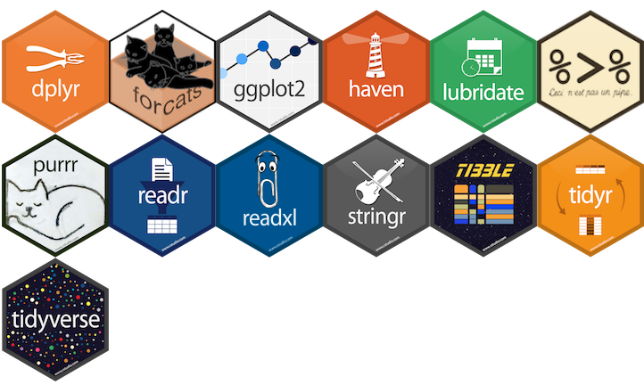

```{r include=FALSE}
library(kableExtra)
```


## Outline

- 7 verbos do *dplyr* para manipulação de dados
  - select, filter, group_by, summarize, mutate, count, arrange
  
- Combinando verbos usando pipes **%>%**
  
- 2 verbos tidyr para remodelar seus dados (pivot_longer, pivot_wider)

---
  
##  Cheat sheet
  
- [Data Wrangling with dplyr and tidyr](https://rstudio.com/wp-content/uploads/2015/02/data-wrangling-cheatsheet.pdf)


```{r, echo=FALSE, fig.cap="", out.width = '70%', fig.align="center", fig.retina = 2, fig.pos='h'}
knitr::include_graphics("https://audhalbritter.com/wp-content/uploads/2016/07/Bildschirmfoto-2016-07-25-um-23.13.54.png")
```


---

##  O que é tidyverse?

- Pacotes para manipulação de dados

- Construído para manipulação de dados

- Torna a manipulação de dados mais fácil do que na base R

- Combina verbos usando pipes
 

 
```{r, echo=FALSE, fig.cap="", out.width = '70%', fig.align="center", fig.retina = 2, fig.pos='h'}

```
 

---


##  Instalando os pacotes (packages)


- install.packages()

- Input: nome do pacote

- Baixe os pacotes do CRAN (Comprehensive R Archive Network)

- Instale apenas uma vez


```{r, warning=FALSE}
#install.packages("tidyverse")
```


```{r, echo=FALSE, fig.cap="", out.width = '50%', fig.align="center", fig.retina = 2, fig.pos='h'}
knitr::include_graphics("https://media.giphy.com/media/128MHrlrHNwwU0/giphy.gif")
```
---

## Carregando pacotes


- library()

- Input: nome do pacote

- Dá acesso ao R para funções no pacote

- Carregue os pacotes sempre que reiniciar o R


```{r}
library(tidyverse)
```


---


## Dados: orange circunference

.pull-left[

- Armazenado em arquivo .csv

- *Linhas*: observação individual de uma laranja

- *Colunas*: variáveis que descrevem o experimento
  - expunit, tree, age, circunference
  
]

.pull-right[

```{r, echo=FALSE, fig.cap="", out.width = '100%', fig.align="center", fig.retina = 2, fig.pos='h'}
knitr::include_graphics("images/orange.png")
```
]

---


##  Importando os dados em tidyverse


- *read_csv()* – importa o conteúdo do arquivo CSV


- *Input*: caminho (a file path)


- *Output* um “tibble”


```{r include=FALSE}
orange <- read_csv("orange.csv")
```

```{r}
read_csv("orange.csv")
```


---

##  Por quê não read.csv()?


- read_csv() é mais rápido


- Cria tibbles


- Mais reproduzível
 


| Data frame           | Tibble                        |
|----------------------|-------------------------------|
| Strings to factors   | Keeps character               |
| Has row names        | No row names                  |
| Changes column names | Keeps column nas as they are  |


---


## verbos dplyr


- O primeiro argumento é sempre uma tabela
   - Tibble ou data frame

- Output é uma nova tabela

- Não altera os dados deo input
   - Deve salvar o output usando <-
  

```python
novo_df <- verb(velho_df, ... )

ou

velho_df <- verb(velho_df, ... )
```


---

##  select()

.pull-left[

- Seleciona colunas de um data frame

- Input: dados e colunas a serem mantidos

- Output: dados com apenas as colunas especificadas


```{r}
select(orange, age)
```

]

.pull-right[

**O mesmo que**


```{r}
tibble(orange$age)
```

]

---


## filter()

.pull-left[

- Escolhe as linhas com base nos valores de uma variável

- **Input**: dados e uma expressão lógica (retorna (retorna true/false)
    - <, >, >=, <=, ==, !=

- **Output**: dados com linhas que correspondem à expressão

```{r}
filter(orange, tree == "1")
```

]

.pull-left[

**O mesmo que**


```{r}
orange[orange$tree == "1",]
```

]

---


## Operador Pipe %>%


- Combina vários verbos

- Sintaxe: %>% no final da linha

- Output da primeira linha se torna o input da proxima linha, etc.

- Diga em voz alta como "então"


```{r}
orange %>% 
  filter(circumference >200) %>% 
     select(tree, circumference)
```


---

##  Exercício #1: praticando pipes (%>%)

- Usando pipes, subset the orange data to include

  - individuos de **age** menor que 600
  
  - retenha apenas as colunas **tree** e **age**

---


##  mutate()


- Cria uma nova coluna

- Input: dados e a definição da nova coluna
  
  - col_name = <valor>

- Output: dados com a nova coluna


```{r}
mutate(orange,
       circ_cm = circumference / 100)
```

]

---

##  mutate()

**Same as**


```{r}
orange %>% 
  mutate(circ_cm = circumference / 100)
```


---

##  Exercício 2: desafio data frame

- Crie um novo data frame a partir dos dados do survey que atenda aos seguintes critérios:
 
   1. contém apenas a coluna da árvore e uma nova coluna chamada **circ_half **
  
   2. **circ_half** contém valores que são metade dos valores da circunferência
 
   3. Inclua apenas idade maior que 500


- **Dica**: pense em como os comandos devem ser ordenados para produzir este quadro de dados!

 
---

## Criando de uma tabela de resumo

.pull-left[


- summarize()
 
- **Input:** dados e uma estatística resumida

  - Eg: mean()
  
  - na.rm = TRUE

- **Output:** uma tabela com a estatística de resumo calculada

]

.pull-right[


```{r}
orange %>% 
  summarize(mean_circ = mean(circumference, 
                             na.rm=TRUE))
```


]

---

## Criação de uma tabela de resumo agrupada

.pull-left[

- **group_by()**
 
- **Input:** dados e uma variável

- **Output:** uma tabela com a estatística de resumo calculada para cada valor único na variável

]

.pull-right[


```{r}
orange %>% 
  group_by(tree) %>% 
  summarize(mean_circ = mean(circumference, 
                             na.rm=TRUE))
```


]

---


## Removendo valores ausentes

.pull-left[

- **is.na()**
  - missing = TRUE
  - not missing = FALSE


- Input: uma coluna

- Output: vetor lógico

- Use-o como entrada para filter()

]

.pull-right[


```{r}
orange %>% 
  filter(!is.na(circumference)) %>%
  group_by(tree) %>% 
  summarize(mean_circ = mean(circumference, 
                             na.rm=TRUE))
```


]

---


## count()

.pull-left[

- Conte o número de observações

- Input:
  - variável categórica
  
- **sort** = TRUE: classifica os resultados

- Output: uma tabela com uma linha para cada variável categórica e uma coluna chamada n com contagens

]

.pull-right[


```{r}
orange %>% 
  count(tree)
```

Same as 


```{r}
orange %>% 
  group_by(tree) %>% 
  summarize(count=n())
```

]


## arrange()


.pull-left[

- Resultados da ordem em ordem crescente

- Input:
  - Uma variável
  - Use desc() colocá-los em ordem decrescente

- Output: Uma tabela ordenada pelos valores da coluna de entrada

]

.pull-right[


```{r}
orange %>% 
  group_by(tree) %>% 
  arrange(desc(circumference))
```

]


##  Exercício 3


1 - Use **group_by()** e summarize}() para calcular a mean(), min(), and max() circumference (mm) de cada árvore (tree).


```{r eval=FALSE, include=FALSE}
library(tidyverse)

orange %>% 
  group_by(tree) %>% 
  summarise(media = mean(circumference), min = min(circumference), max = max(circumference))
```


2 - **Bonus**: Quantos dias se passaram desde a primeira até a última medição da circunferência?

```{r eval=FALSE, include=FALSE}
orange %>% 
  group_by(tree) %>% 
  summarise(dias = max(age) -  min(age))
```

---


## Remodelando dados com tidyr

.pull-left[

- A forma dos seus dados afeta o que você pode fazer com eles

- **Exemplo**: compare a média circumference de cada tree adicionando uma nova coluna (High or Low) circumference size (tamanho da circunferência)

]

.pull-right[

```{r, echo=FALSE, fig.cap="", out.width = '100%', fig.align="center", fig.retina = 2, fig.pos='h'}
knitr::include_graphics("images/orange.png")
```

]


---

## Exercício 4

.pull-left[

- Crie uma tabela com colunas para tree e circunference e **mean** circunference. Adicione um parâmetro lógico para circunference, *>* 100 (High) ou *<* 100 (Low)

- Salve em um novo objeto chamado **orange_nd**

]


.pull-right[


```{r}
orange_nd <- orange %>% 
  select(tree, circumference) %>%
  mutate(size = factor(1*(circumference > 100), 
               labels = c("Low", "High"))) %>% 
  group_by(size, tree) %>% 
  summarise(mean_cir = mean(circumference))
  
orange_nd
```

]


## Tidy Data


.pull-left[

1) Cada variável tem sua própria coluna

2) Cada observação tem sua própria linha

3) Cada valor tem sua própria célula

4) Cada tipo de unidade observacional forma uma tabela
 

]


.pull-right[

```{r, echo=FALSE, fig.cap="", out.width = '80%', fig.align="center", fig.retina = 2, fig.pos='h'}
knitr::include_graphics("images/tidying.png")
```

]


---

## Remodelando dados com tidyr


.pull-left[

- Spreading: faz uma tabela mais ampla
  - Valores únicos em uma coluna especificada (key) tornam-se nomes de variáveis

- Gathering: faz uma tabela mais longa
  - Nomes de variáveis tornam-se valores em uma nova coluna (key)


]

.pull-right[

```{r, echo=FALSE, fig.cap="", out.width = '100%', fig.align="center", fig.retina = 2, fig.pos='h'}
knitr::include_graphics("images/tidyr.png")
```

]

---


## pivot_wider()


.pull-left[

- use-o quando uma observação estiver espalhada por várias linhas

- **Input:**
  - tabela (tibble / data frame)
  - coluna-chave (os valores tornam-se novos nomes de coluna)
  - coluna de valor (para preencher novas variáveis de coluna)

- **Output:** uma tabela com colunas para cada valor de sexo


]

.pull-right[

```{r}
orange_spread <- orange_nd %>% 
  pivot_wider(names_from = tree,
         values_from = mean_cir)

orange_spread
```

]

---


## Espalhar


```{r, echo=FALSE, fig.cap="", out.width = '100%', fig.align="center", fig.retina = 2, fig.pos='h'}

```

---

## pivot_longer()

.pull-left[

- Use quando os nomes das colunas não forem nomes de variáveis, mas valores de uma variável

- **Input:**
  - data (a tibble)
  - key column (created from col names)
  - values column (fill the key variable)
  - A range of columns to gather

- **Output:** a long tibble


]


.pull-right[


```{r, warning=FALSE}
orange_gather <- orange_spread %>% 
  pivot_longer(names_to = "tree",
         cols = "1":"2":"3":"4":"5")

orange_gather
```


]


---

## Gather


```{r, echo=FALSE, fig.cap="", out.width = '100%', fig.align="center", fig.retina = 2, fig.pos='h'}

```


---

## Exercício 5


- Espalhe o **orange_nd** data frame com o tamanho das colunas, tree como linhas e the **mean_cir** per plot as the values. 

.pull-left[

Fazer essa tabela:

```{r echo=FALSE}
kable(orange_nd)
```

]


.pull-right[

```{r include=FALSE}
orange_nd <- orange_nd %>% 
  pivot_wider(names_from = size,
         values_from = mean_cir)
```

Ficar assim:

```{r echo=FALSE}
kable(orange_nd)
```

]

---

## write_csv

.pull-left[

- Grava uma tabela de dados em um arquivo

- **Input:** uma tibble, um caminho de arquivo

-  **Output:** um arquivo no caminho de arquivo especificado


]

.pull-right[


```{r}
write_csv(orange_nd,
          path = "orange2.csv")
```

]


---

## Preciso de ajuda?

- **Email**: maxweloliveira@unoeste.br

- Repositório Github: [Link](https://github.com/maxwelco)


- Data Wrangling cheat sheet: [Link](https://rstudio.com/wp-content/uploads/2015/02/data-wrangling-cheatsheet.pdf)


